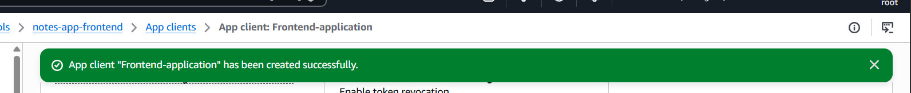
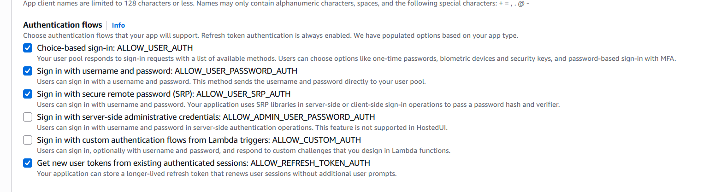
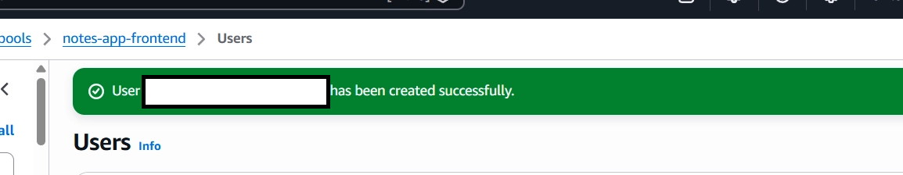
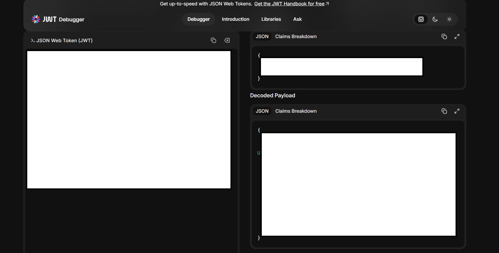

# Component 1 — Amazon Cognito User Pool

## Objective

The first component of this project was to create the authentication foundation for an authenticated Notes API using Amazon Cognito.

The Cognito User Pool is responsible for:

- registering users
- securely authenticating users
- enforcing password requirements
- issuing JSON Web Tokens (JWTs)
- providing each user with a unique, trusted identity

Every later component relies on the identity contained inside the Cognito-issued Access Token. API Gateway will validate this token before allowing requests to reach Lambda.

---

## AWS Services Used

- Amazon Cognito
- AWS CloudShell
- AWS CLI

---

## What Was Created

An Amazon Cognito User Pool named:

```text
notes-app-frontend
```

The User Pool was configured with:

- Email as the sign-in identifier
- Email as a required user attribute
- Self-registration enabled
- Cognito-managed email delivery
- Default password policy
- A public Single-Page Application app client
- No app client secret
- Refresh token authentication enabled

A test user was also created to verify that Cognito could successfully authenticate a real account and issue tokens.

---

## Why Amazon Cognito?

Authentication involves considerably more than checking whether a username and password match.

A production authentication system must securely handle:

- password storage and hashing
- account registration
- password policies
- token signing
- token expiry
- refresh tokens
- key rotation
- account recovery
- protection against common authentication attacks

Implementing these capabilities manually would introduce unnecessary security risk.

Amazon Cognito provides a managed authentication service designed specifically for these responsibilities.

For this project, Cognito answers:

```text
Who is this user?
```

and issues a signed JWT containing a trusted user identity.

---

## Authentication Flow

```text
User
  │
  │ Supplies email and password
  ▼
Cognito User Pool
  │
  │ Validates credentials
  ▼
Cognito issues JWTs
  │
  ├── Access Token
  ├── ID Token
  └── Refresh Token
```

The Access Token will later be sent to API Gateway in the following header:

```text
Authorization: Bearer <access-token>
```

API Gateway will validate the token before invoking Lambda.

---

## Initial Configuration Mistake

The first application configuration used:

```text
Traditional web application
```

This caused Cognito to create a confidential app client containing a client secret.

That configuration was incorrect for this project.

A traditional web application is assumed to have a trusted backend server capable of securely storing a client secret.

This project will use a browser-based frontend, where anything included in JavaScript can be inspected through:

- browser developer tools
- source code
- network requests
- downloaded frontend files

A browser therefore cannot safely protect a client secret.

The incorrect app client was removed and replaced with a:

```text
Single-Page Application (SPA)
```

app client.

The SPA configuration creates a public client without a client secret.

---

## Public Client Without a Secret

The Cognito app client was deliberately configured without a client secret.

A client secret is only useful when it can genuinely remain secret.

Embedding one inside browser code would provide no meaningful security because any visitor could inspect and copy it.

The correct design is therefore:

```text
Browser application
        │
        ▼
Public Cognito app client
        │
        └── No client secret
```

This follows the same security principle used throughout the portfolio:

> Credentials must never be hardcoded into client-side applications.

---

## Authentication Flows

The following authentication flows were enabled:

```text
ALLOW_USER_AUTH
ALLOW_USER_PASSWORD_AUTH
ALLOW_USER_SRP_AUTH
ALLOW_REFRESH_TOKEN_AUTH
```

### `ALLOW_USER_PASSWORD_AUTH`

This flow allows authentication using a username and password through the AWS CLI.

It was enabled primarily to make Cognito token issuance easy to verify during development.

### `ALLOW_USER_SRP_AUTH`

Secure Remote Password authentication uses a challenge-response process rather than directly sending the password during authentication.

This is the more suitable flow for a real browser application using an appropriate Cognito SDK.

### `ALLOW_REFRESH_TOKEN_AUTH`

This permits a refresh token to obtain new short-lived tokens without forcing the user to enter their credentials again.

Multiple flows can be enabled simultaneously. Enabling password authentication for CLI testing does not disable SRP support.

---

## User Pool vs Identity Pool

A Cognito User Pool and Cognito Identity Pool solve different problems.

| Service | Purpose |
|---|---|
| User Pool | Authenticates users and issues JWTs |
| Identity Pool | Exchanges an authenticated identity for temporary AWS credentials |

This project uses a User Pool because the frontend communicates with API Gateway rather than directly accessing AWS services.

An Identity Pool is unnecessary because users do not need temporary IAM credentials for direct access to DynamoDB, S3, or Lambda.

---

## Access Token vs ID Token

Cognito returns multiple tokens after successful authentication.

### Access Token

The Access Token is used to authorise API requests.

It contains claims such as:

```text
sub
token_use
scope
client_id
exp
```

This is the token that API Gateway's JWT authorizer will validate in Component 2.

### ID Token

The ID Token contains user profile information intended for the application, such as:

```text
email
username
other profile attributes
```

A simple way to remember the distinction is:

```text
Access Token = What may this user access?
ID Token     = Who is this user?
```

---

## Creating a Test User

A test user was created from the Cognito User Pool's **Users** section.

The console-created user initially received a temporary password.

When the user first attempted to authenticate, Cognito returned:

```text
NEW_PASSWORD_REQUIRED
```

This is expected behaviour.

Cognito does not issue the final authentication tokens until the user replaces the administrator-created temporary password with a permanent password.

---

## Handling `NEW_PASSWORD_REQUIRED`

The authentication process occurred in two stages.

### Stage 1 — Initial Authentication

The AWS CLI was used to authenticate with the temporary credentials:

```bash
aws cognito-idp initiate-auth \
  --auth-flow USER_PASSWORD_AUTH \
  --client-id <app-client-id> \
  --auth-parameters '{
    "USERNAME": "<test-user-email>",
    "PASSWORD": "<temporary-password>"
  }'
```

Cognito returned a:

```text
NEW_PASSWORD_REQUIRED
```

challenge and a temporary session value.

### Stage 2 — Responding to the Challenge

The challenge was completed using:

```bash
aws cognito-idp respond-to-auth-challenge \
  --client-id <app-client-id> \
  --challenge-name NEW_PASSWORD_REQUIRED \
  --session "<temporary-session-value>" \
  --challenge-responses '{
    "USERNAME": "<test-user-email>",
    "NEW_PASSWORD": "<new-permanent-password>"
  }'
```

Sensitive values have deliberately been replaced with placeholders.

After the password challenge was completed, Cognito returned a genuine authentication result containing:

- Access Token
- Refresh Token
- Token type
- Token expiry

The Access Token had a lifetime of:

```text
3600 seconds
```

or one hour.

---

## JWT Structure

A JSON Web Token contains three dot-separated sections:

```text
header.payload.signature
```

### Header

The header describes how the token was signed.

Example claims include:

```text
alg
kid
```

### Payload

The payload contains the token claims.

Relevant claims included:

```text
sub
iss
client_id
token_use
scope
exp
iat
```

### Signature

The signature allows services such as API Gateway to verify that:

- Cognito issued the token
- the payload has not been changed
- the token belongs to the expected User Pool
- the token has not expired

The JWT payload can be decoded for inspection, but decoding alone does not validate its signature.

---

## The `sub` Claim

The most important claim for this project's security design is:

```text
sub
```

The `sub` value is a stable, Cognito-generated identifier for a specific user.

It is:

- generated by Cognito
- unique to that user
- included inside the signed token
- not based on the user's email address
- not chosen by the client
- not trusted from the request body

Later, Lambda will read this value only from the JWT claims that API Gateway has already validated.

It will become the DynamoDB partition key used to isolate each user's notes.

```text
Verified Access Token
        │
        ▼
sub claim
        │
        ▼
DynamoDB userid partition key
```

This means the client never gets to choose which user's records Lambda queries.

---

## Verification

Authentication was verified by completing the Cognito password challenge through the AWS CLI.

Cognito returned a valid authentication result containing a short-lived Access Token and a Refresh Token.

The Access Token was then decoded to inspect its claims.

The decoded token confirmed:

- `token_use` was set to `access`
- the issuer matched the Cognito User Pool
- the client ID matched the public SPA app client
- the token contained an expiry time
- Cognito assigned the user a unique `sub` identifier

This proved that Cognito successfully authenticated the test user and issued a genuine signed identity token for use by the API.

---

## Screenshots

### SPA App Client Created

The replacement Single-Page Application app client was created successfully without a client secret.



---

### Authentication Flows Configured

Password authentication, SRP authentication and refresh-token authentication were enabled for the app client.



---

### Test User Created

A test user was created inside the Cognito User Pool to verify the authentication process.



---

### Access Token Decoded

The Cognito-issued Access Token was decoded to inspect its claims, including the unique `sub` identifier and `token_use: access`.

The raw token has been excluded from the repository because an Access Token is a live credential until it expires.



---

## Problems Encountered

### Incorrect Application Type

**Problem:** The first app client contained a client secret.

**Cause:** The application type was configured as a Traditional web application.

**Resolution:** The incorrect client was removed and recreated as a Single-Page Application.

**Result:** Cognito produced a public app client without a client secret.

---

### Password Authentication Not Enabled

**Problem:** The intended CLI authentication flow was unavailable.

**Cause:** SPA app clients favour SRP authentication and did not initially have `ALLOW_USER_PASSWORD_AUTH` enabled.

**Resolution:** `ALLOW_USER_PASSWORD_AUTH` was enabled alongside `ALLOW_USER_SRP_AUTH`.

**Result:** CLI authentication could be used for testing while retaining SRP support for a future frontend.

---

### Special Characters in CLI Input

**Problem:** Password characters interfered with CLI parsing.

**Cause:** Certain characters were interpreted as shell or shorthand syntax.

**Resolution:** Authentication parameters were supplied as JSON enclosed in single quotes.

---

### New Password Challenge

**Problem:** The initial authentication attempt returned no tokens.

**Cause:** The console-created user had a temporary password.

**Resolution:** The `NEW_PASSWORD_REQUIRED` challenge was completed using `respond-to-auth-challenge`.

**Result:** Cognito issued valid authentication tokens.

---

## Security Considerations

The following security decisions were applied:

- The browser app client has no client secret.
- Authentication is delegated to a managed AWS service.
- Passwords are never stored by the application.
- Tokens have limited lifetimes.
- The API will use the Access Token rather than trusting client-supplied identity.
- The Cognito-generated `sub` claim will identify the caller.
- Raw passwords, session values and tokens are excluded from the repository.
- Authentication and application data storage remain separate concerns.

---

## Key Design Decisions

| Decision | Reason |
|---|---|
| Cognito User Pool | Provides managed user authentication and JWT issuance |
| Email sign-in | Gives users a familiar login identifier |
| SPA app client | Appropriate for a browser-based application |
| No client secret | A browser cannot safely protect one |
| SRP enabled | Supports secure browser authentication |
| Password auth enabled | Simplifies AWS CLI verification |
| Refresh tokens enabled | Supports longer-lived user sessions |
| Cognito `sub` as identity | Provides a trusted and unforgeable user identifier |
| No Identity Pool | The frontend never calls AWS services directly |

---

## Lessons Learned

During this component I learned:

- Cognito User Pools authenticate users and issue JWTs.
- Cognito Identity Pools provide temporary IAM credentials and solve a different problem.
- Browser applications must use public clients without client secrets.
- SPA and traditional web application clients have different security assumptions.
- Cognito can support multiple authentication flows simultaneously.
- Console-created users must replace temporary passwords before receiving tokens.
- Access Tokens and ID Tokens have different purposes.
- JWT decoding and JWT verification are different operations.
- The `sub` claim provides a trustworthy identity for later data isolation.
- Tokens and authentication sessions must be treated as credentials and kept out of repositories.
