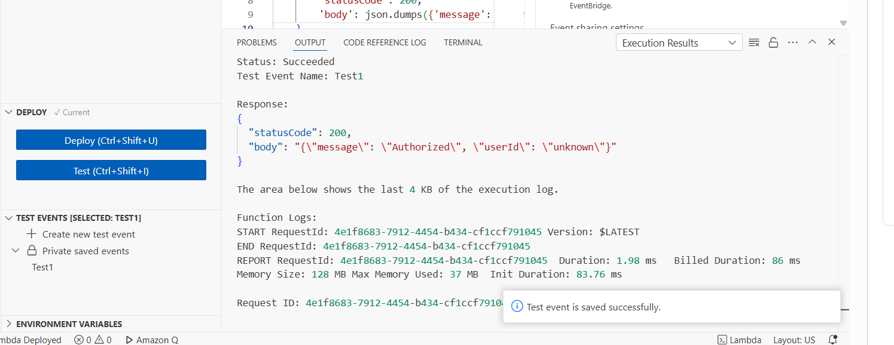

# Component 2: API Gateway with a JWT Authorizer

## Overview

The goal of this component was to introduce authentication into the application using **Amazon Cognito** and **API Gateway JWT Authorizers**.

Unlike the previous project, where every request could invoke a Lambda function, this component ensures that only authenticated users can access protected API endpoints. Authentication is performed by API Gateway before a request ever reaches Lambda, allowing invalid requests to be rejected immediately while passing verified user information to downstream services.

Rather than building CRUD functionality immediately, this component focuses solely on proving that the authentication flow works correctly in isolation before adding any application logic.

---

# Architecture

```text
                 Amazon Cognito
                      │
          Issues signed JWT Access Token
                      │
                      ▼
              HTTP Request
Authorization: Bearer <JWT>
                      │
                      ▼
              API Gateway HTTP API
             (JWT Authorizer)
                      │
          ┌───────────┴────────────┐
          │                        │
   Invalid Token             Valid Token
          │                        │
      HTTP 401                 Invoke Lambda
                                   │
                                   ▼
                            whoamiHandler
                                   │
                                   ▼
                           Return User ID
```

---

# Objectives

The objectives of this component were to:

- Configure Amazon Cognito to issue JWT access tokens.
- Create a Lambda function capable of identifying the authenticated user.
- Protect an API Gateway endpoint using a JWT Authorizer.
- Prevent unauthenticated requests from reaching the backend.
- Demonstrate how API Gateway passes verified JWT claims directly to Lambda.

---

# AWS Services Used

| Service | Purpose |
|----------|---------|
| Amazon Cognito | User authentication and JWT token generation |
| Amazon API Gateway | Secure HTTP API |
| JWT Authorizer | Validates Cognito-issued access tokens |
| AWS Lambda | Reads authenticated user claims |
| AWS CloudShell | Authentication testing |
| jwt.io | JWT decoding and inspection |

---

# Step 1 – Creating the Authentication Lambda

The first step was creating a Lambda function that simply identifies the authenticated user.

This Lambda intentionally contains **no business logic**. It doesn't interact with DynamoDB, S3 or any other AWS service.

Instead, its only responsibility is reading the authenticated user's identity after API Gateway has successfully validated the incoming JWT.

The function was created with the following configuration:

- **Function name:** `whoamiHandler`
- **Runtime:** Python 3.13
- **Architecture:** arm64
- **Execution Role:** Default Lambda execution role (CloudWatch logging permissions only)

The default Lambda template was then replaced with the following code:

```python
import json

def lambda_handler(event, context):
    claims = event.get('requestContext', {}).get('authorizer', {}).get('jwt', {}).get('claims', {})
    user_id = claims.get('sub', 'unknown')

    return {
        'statusCode': 200,
        'body': json.dumps({
            'message': 'Authorized',
            'userId': user_id
        })
    }
```

---

## Understanding the Lambda Code

Although this Lambda appears very simple, there is an important design decision behind it.

The function **does not perform any JWT validation itself**.

It does **not**:

- Verify the JWT signature.
- Check whether the token has expired.
- Validate the issuer.
- Validate the audience.
- Parse the token manually.

Instead, it simply reads:

```python
event.requestContext.authorizer.jwt.claims
```

This object is automatically populated by **API Gateway** after it has successfully verified the incoming JWT.

By the time the Lambda function executes, the authentication process has already completed.

This provides several advantages:

- JWT verification is performed once, centrally, by API Gateway.
- Every downstream Lambda receives trusted identity information.
- Individual Lambda functions remain simple and focused on business logic.
- Authentication logic is not duplicated across every function.

This separation of responsibilities is one of the primary reasons JWT Authorizers are preferred over implementing token validation inside every Lambda.

---

## Testing the Lambda

Before introducing API Gateway, the function was tested using Lambda's built-in **Test Event** feature.

The function returned the following response:

```json
{
    "statusCode": 200,
    "body": "{\"message\":\"Authorized\",\"userId\":\"unknown\"}"
}
```

### Screenshot



At first glance this may appear incorrect because the returned user ID is `"unknown"`.

However, this is actually the expected behaviour.

The Lambda console test sends a simple JSON payload directly to the function and completely bypasses API Gateway.

Because API Gateway is never involved, the event contains no authenticated JWT claims.

As a result, this line of code:

```python
user_id = claims.get("sub", "unknown")
```

falls back to the default value of `"unknown"`.

Rather than indicating a problem, this confirms that the fallback logic behaves correctly when no authenticated identity exists.

The real verification would come later once API Gateway was introduced and responsible for validating JWTs before invoking the Lambda function.

---

## What Was Achieved

At the end of this stage:

- A dedicated authentication Lambda had been created.
- The Lambda successfully handled requests without crashing.
- The function correctly returned a default value when no JWT claims were present.
- The code was ready to be integrated with API Gateway and a JWT Authorizer in the next stage of the project.

---

## Skills Demonstrated

- AWS Lambda
- Python
- HTTP APIs
- JWT Claims
- Authentication Flow
- API Gateway Integration
- Secure Serverless Design
- CloudWatch Logging

# Step 2 – Creating the HTTP API

With the Lambda function complete, the next step was exposing it through **Amazon API Gateway**.

The purpose of this API was not to implement application functionality yet, but rather to create a secure endpoint that could later be protected using JWT authentication.

A new **HTTP API** was created with the following configuration:

- **API Name:** `notes-api`
- **Protocol:** HTTP API
- **Integration:** `whoamiHandler`
- **Route:** `GET /whoami`

Unlike REST APIs, HTTP APIs are designed to be simpler, lower latency and significantly cheaper while still supporting JWT Authorizers. Since this project only required standard HTTP routing and authentication, an HTTP API was the most appropriate choice.

### Screenshot


---

## Why a `/whoami` Endpoint?

Rather than immediately building notes functionality, a simple endpoint was created that returned the authenticated user's identity.

This keeps the component focused on testing authentication rather than application logic.

If authentication failed, the request should never reach the Lambda.

If authentication succeeded, Lambda would simply return the authenticated user's unique identifier.

This made it very easy to prove that authentication was functioning correctly before adding any CRUD operations.

---

# Step 3 – Configuring the JWT Authorizer

Once the API had been created, the next task was protecting the `/whoami` endpoint using an API Gateway **JWT Authorizer**.

This is an important distinction worth understanding.

REST APIs provide a dedicated **Cognito User Pool Authorizer**, whereas HTTP APIs instead use a generic **JWT Authorizer**.

Although it isn't labelled as a Cognito authorizer, it works perfectly with Cognito because Cognito issues standards-compliant OpenID Connect (OIDC) JSON Web Tokens.

Rather than selecting "Amazon Cognito" from a list, API Gateway validates JWTs using two pieces of information:

- Issuer
- Audience

---

## Creating the JWT Authorizer

Within API Gateway:

**Authorization → Create and Attach an Authorizer → JWT**

The following values were configured:

| Setting | Value |
|---------|------|
| Authorizer Type | JWT |
| Name | `who-am-I-authoriser` |
| Identity Source | `$request.header.Authorization` |
| Issuer URL | `<Cognito User Pool Issuer URL>` |
| Audience | `<App Client ID>` |

> **Note:** The Issuer URL and Audience values have been redacted from this repository. These values identify the Cognito User Pool and App Client used during development.

### Screenshot


---

## Understanding the Issuer

The **Issuer URL** tells API Gateway which identity provider issued the JWT.

Every Cognito-issued JWT contains an `iss` (issuer) claim.

When API Gateway receives an incoming token, it compares the token's `iss` claim against the configured Issuer URL.

If these values do not match, authentication immediately fails.

Earlier in this project, the JWT was decoded using **jwt.io**, where this issuer claim could already be seen inside the decoded payload.

Rather than manually typing the Issuer URL, it was copied directly from the decoded JWT to eliminate the possibility of configuration errors.

---

## Understanding the Audience

The **Audience** identifies which application the token was originally issued for.

Every JWT issued by Cognito also contains an audience/client identifier.

API Gateway verifies that the token was issued specifically for this application before allowing the request through.

This prevents a token generated for one application from being accepted by another.

For security reasons, the App Client ID has been redacted from this repository.

---

## Why Authentication Happens in API Gateway

One of the biggest architectural decisions in this project is where authentication takes place.

Many beginners validate JWTs inside every Lambda function.

While this works, it introduces duplicated code, repeated cryptographic verification and unnecessary complexity.

Instead, authentication is delegated entirely to API Gateway.

The request lifecycle therefore becomes:

```text
Client Request
      │
      ▼
API Gateway JWT Authorizer
      │
Validates:
 • Signature
 • Expiry
 • Issuer
 • Audience
      │
      ▼
Valid Request?
      │
 ┌────┴─────┐
 │          │
No         Yes
 │          │
401     Invoke Lambda
            │
            ▼
Lambda reads trusted claims
```

This provides several advantages:

- JWT verification occurs only once.
- Every Lambda receives trusted claims.
- Individual Lambda functions remain much smaller.
- Business logic remains completely separate from authentication.
- Invalid requests never consume Lambda execution time.

This is considered a best practice when building serverless APIs.

---

## Attaching the Authorizer

Once the authorizer had been created, it was attached to the existing `GET /whoami` route.

From this point onwards, API Gateway would no longer allow anonymous requests to reach the backend.

Instead, every request must now include a valid Cognito-issued JWT inside the following HTTP header:

```http
Authorization: Bearer <Access Token>
```

Requests without a valid token would automatically receive an HTTP **401 Unauthorized** response before the Lambda function executed.

### Screenshot


---

## What Was Achieved

At the end of this stage:

- A new HTTP API had been created.
- The `/whoami` endpoint was exposed publicly.
- A JWT Authorizer was configured against Amazon Cognito.
- Authentication was moved entirely into API Gateway.
- Anonymous requests would now be blocked automatically before reaching Lambda.

The next step was generating a real Cognito access token and testing the protected endpoint from CloudShell.

---

## Skills Demonstrated

- Amazon API Gateway
- HTTP APIs
- JWT Authorizers
- Amazon Cognito Integration
- OpenID Connect (OIDC)
- Secure API Design
- Authentication Architecture
- Serverless Security Best Practices

# Step 4 – Testing the Protected API

With the JWT Authorizer attached, the next stage was verifying that authentication behaved exactly as expected.

Rather than relying on the Lambda console, the API was tested externally using **AWS CloudShell** and `curl`.

The objective was to prove two scenarios:

- Unauthenticated requests are rejected before reaching Lambda.
- Authenticated requests successfully reach Lambda with verified JWT claims.

---

## Obtaining an Access Token

Before the protected endpoint could be tested, an Access Token needed to be generated by Amazon Cognito.

Authentication was performed through the AWS CLI.

Because the test user had previously completed the **NEW_PASSWORD_REQUIRED** challenge during Component 1, authentication now returned a valid `AuthenticationResult` immediately.

For security reasons, the following values have been replaced with placeholders:

- App Client ID
- Email Address
- Password

```bash
aws cognito-idp initiate-auth \
  --auth-flow USER_PASSWORD_AUTH \
  --client-id <app-client-id> \
  --auth-parameters '{
    "USERNAME":"<email-address>",
    "PASSWORD":"<password>"
}'
```

A successful authentication returned:

- Access Token
- Refresh Token
- Token Type
- Expiration Time

The Access Token would later be supplied to API Gateway using the HTTP Authorization header.

---

# Initial Authentication Tests

Before testing a valid JWT, the protected endpoint was deliberately accessed without any authentication.

```bash
curl -i https://<api-endpoint>/whoami
```

The response returned:

```text
HTTP/2 401 Unauthorized
```

This was the expected behaviour.

The request never reached the Lambda function because API Gateway rejected it during authentication.

This demonstrated that the JWT Authorizer was correctly protecting the endpoint.

---

# Troubleshooting Authentication

Although the API was configured correctly, several authentication problems were encountered during testing.

Each failure helped confirm a different part of the authentication process.

---

## Smart Quotes Introduced During Copy & Paste

The first issue occurred when copying commands into CloudShell.

Some quotation marks had been converted into typographic ("smart") quotes by the browser, causing Bash to interpret the command incorrectly.

This was resolved by manually typing the command structure and only pasting the token value.

---

## Missing Bearer Prefix

A later request supplied only the Access Token itself:

```text
<JWT Token>
```

instead of:

```text
Authorization: Bearer <JWT Token>
```

API Gateway therefore ignored the token entirely because it only inspects the Authorization header when it follows the standard Bearer authentication format.

---

## Truncated JWT

The most significant issue occurred while manually copying the Access Token.

JWTs are long Base64URL encoded strings containing three sections separated by periods:

```text
header.payload.signature
```

Manually selecting the token from the terminal repeatedly resulted in the beginning of the token being truncated.

Every valid JWT begins with something similar to:

```text
eyJ...
```

When the beginning of the token was accidentally omitted, API Gateway responded with:

```text
HTTP/2 401 Unauthorized

{
  "error": "invalid_token",
  "error_description": "token contains an invalid number of segments"
}
```

This confirmed that API Gateway had attempted to parse the JWT but rejected it because it no longer contained the expected three-part structure.

---

# Eliminating Manual Copy & Paste

Rather than continuing to copy long JWTs manually, the authentication process was improved by allowing Bash to extract the Access Token automatically.

The authentication response was first captured into a shell variable.

```bash
RESPONSE=$(aws cognito-idp initiate-auth \
  --auth-flow USER_PASSWORD_AUTH \
  --client-id <app-client-id> \
  --auth-parameters '{
    "USERNAME":"<email-address>",
    "PASSWORD":"<password>"
}')
```

The Access Token was then extracted using `jq`.

```bash
ACCESS_TOKEN=$(echo "$RESPONSE" | jq -r '.AuthenticationResult.AccessToken')
```

Finally, two quick validation checks confirmed that the token had been extracted correctly.

```bash
echo "Starts with: ${ACCESS_TOKEN:0:10}"
echo "Length: ${#ACCESS_TOKEN}"
```

The output confirmed:

- the token began with the expected JWT prefix
- the token length matched a complete Cognito Access Token

By extracting the token programmatically, manual copy-and-paste errors were eliminated completely.

---

# Successful Authentication

The protected endpoint was then called using the automatically extracted token.

```bash
curl -i https://<api-endpoint>/whoami \
  -H "Authorization: Bearer $ACCESS_TOKEN"
```

API Gateway returned:

```http
HTTP/2 200 OK
```

with the response:

```json
{
    "message": "Authorized",
    "userId": "<cognito-sub>"
}
```

### Screenshot


---

# Verifying the User Identity

The returned `userId` matched the `sub` claim that had previously been decoded from the Cognito Access Token during Component 1.

This proved the complete authentication chain was functioning correctly.

```text
Amazon Cognito
        │
 Issues signed JWT
        │
        ▼
API Gateway JWT Authorizer
        │
 Validates:
 • Signature
 • Expiry
 • Issuer
 • Audience
        │
        ▼
Injects verified claims
        │
        ▼
Lambda
        │
Reads:
event.requestContext.authorizer.jwt.claims.sub
        │
        ▼
Returns authenticated user ID
```

Most importantly, the Lambda function never performed any JWT validation itself.

Instead, it trusted the identity already verified by API Gateway.

This keeps authentication centralised and prevents duplicated verification logic across multiple Lambda functions.

---

# What Was Achieved

At the end of this stage:

- Cognito successfully authenticated the user.
- API Gateway rejected anonymous requests.
- API Gateway rejected malformed JWTs.
- API Gateway successfully validated a genuine Cognito Access Token.
- Verified JWT claims were automatically passed into Lambda.
- Lambda successfully returned the authenticated user's unique Cognito `sub` identifier.

This completed the authentication flow and demonstrated that secure identity could now be passed into future CRUD operations without requiring Lambda to perform any manual JWT verification.

---

## Skills Demonstrated

- Amazon Cognito Authentication
- AWS CLI
- CloudShell
- JWT Tokens
- HTTP Authorization Headers
- API Gateway JWT Authorizers
- Secure API Testing
- Bash
- jq
- Authentication Troubleshooting
- Serverless Authentication Architecture

# Verification

The authentication flow was tested end-to-end to ensure each component behaved as expected.

| Test | Expected Result | Outcome |
|------|-----------------|---------|
| Invoke Lambda directly | Returns `"userId": "unknown"` | ✅ Passed |
| Call API without JWT | HTTP 401 Unauthorized | ✅ Passed |
| Call API with malformed JWT | HTTP 401 Unauthorized | ✅ Passed |
| Call API with valid Cognito Access Token | HTTP 200 OK | ✅ Passed |
| Retrieve authenticated user's `sub` claim | Returned successfully | ✅ Passed |

These tests confirmed that API Gateway correctly validated incoming JWTs before invoking the Lambda function and only forwarded requests containing valid Cognito-issued access tokens.

---

# Security Considerations

Several security best practices were followed throughout this component.

### JWT Validation

JWT validation was delegated entirely to API Gateway rather than being implemented inside the Lambda function.

This ensures that:

- JWT signatures are cryptographically verified.
- Expired tokens are rejected automatically.
- Tokens issued by another identity provider cannot be used.
- Tokens intended for another application are rejected.

Only authenticated requests are forwarded to Lambda.

---

### Principle of Least Privilege

The Lambda execution role only requires basic CloudWatch logging permissions.

No unnecessary IAM permissions were granted because the function simply reads authenticated user claims and returns a response.

As future components introduce DynamoDB integration, additional permissions will be added only when required.

---

### Sensitive Information

To ensure this repository is safe for public viewing, the following information has been removed or replaced with placeholders:

- Cognito User Pool IDs
- App Client IDs
- AWS Account IDs
- JWT Access Tokens
- Refresh Tokens
- Email Addresses
- Passwords
- API Gateway URLs
- Session Tokens
- Request IDs

This allows the project to demonstrate the implementation without exposing sensitive credentials.

---

# Key Concepts Learned

This component introduced several important serverless authentication concepts.

### Amazon Cognito

Amazon Cognito provides user authentication and securely issues signed JSON Web Tokens (JWTs) after successful login.

Rather than building authentication manually, Cognito handles:

- User registration
- Password management
- Secure authentication
- Token generation

---

### JWT Authorizers

HTTP APIs use JWT Authorizers to validate tokens before requests reach backend services.

Rather than trusting any JWT, API Gateway verifies:

- Signature
- Expiration
- Issuer
- Audience

Only requests that successfully pass these checks are allowed to invoke the Lambda function.

---

### Separation of Responsibilities

One of the biggest architectural lessons from this project is separating authentication from business logic.

API Gateway is responsible for:

- Authentication
- Token validation
- Identity verification

Lambda is responsible for:

- Application logic
- Reading authenticated claims
- Returning responses

Keeping these responsibilities separate makes applications easier to maintain and reduces duplicated authentication code.

---

### JWT Claims

Rather than decoding tokens manually, Lambda simply reads the verified claims injected by API Gateway.

For this component, the most important claim was:

```text
sub
```

The `sub` (Subject) claim uniquely identifies each authenticated Cognito user.

Future components will use this value as the partition key when storing notes in DynamoDB, ensuring each user only accesses their own data.

---

# Challenges Encountered

Several issues were encountered during development.

### Copy-and-Paste Errors

Long JWT strings were occasionally truncated when copied manually from CloudShell.

This resulted in malformed JWTs that API Gateway correctly rejected.

The issue was resolved by extracting the Access Token programmatically using `jq`.

---

### Lambda Console Testing

Initially, the Lambda console always returned:

```json
"userId": "unknown"
```

This behaviour was expected because Lambda test events bypass API Gateway entirely and therefore contain no authenticated claims.

Understanding the difference between direct Lambda testing and API Gateway requests was an important learning point.

---

### Understanding JWT Authorizers

Initially it was unclear why HTTP APIs did not include a dedicated Cognito Authorizer option.

Through experimentation it became clear that HTTP APIs instead implement a generic OpenID Connect (OIDC) JWT Authorizer.

Since Amazon Cognito issues standards-compliant JWTs, this provides the same authentication capability while supporting additional identity providers.

---

# What Was Achieved

By the end of this component:

- Amazon Cognito successfully authenticated users.
- API Gateway protected the `/whoami` endpoint using a JWT Authorizer.
- Invalid requests were rejected before reaching Lambda.
- Valid JWTs successfully invoked the backend.
- Lambda received verified JWT claims from API Gateway.
- The authenticated user's unique Cognito identifier (`sub`) was successfully returned.
- The authentication architecture was fully validated and ready for future application functionality.

This establishes the security foundation that all future API endpoints will build upon.

---

# Skills Demonstrated

- Amazon Cognito
- Amazon API Gateway
- HTTP APIs
- JWT Authorizers
- JSON Web Tokens (JWT)
- OpenID Connect (OIDC)
- AWS Lambda
- Python
- AWS CLI
- CloudShell
- Bash
- jq
- Secure API Design
- Authentication Architecture
- Serverless Development
- IAM
- CloudWatch

---

# Future Improvements

The next component will build upon this authentication layer by introducing persistent data storage using Amazon DynamoDB.

Planned functionality includes:

- Creating notes
- Retrieving notes
- Updating notes
- Deleting notes
- Restricting access so users can only manage their own notes using the authenticated Cognito `sub` identifier

By combining Cognito authentication with DynamoDB access control, the application will evolve from a proof-of-concept authentication service into a fully functional multi-user serverless notes application.

---

# Conclusion

This component successfully introduced secure authentication into the application using Amazon Cognito and API Gateway JWT Authorizers.

Rather than implementing JWT validation inside every Lambda function, authentication was delegated to API Gateway, allowing invalid requests to be rejected before consuming compute resources while providing trusted identity information to downstream services.

The project demonstrates a secure and scalable serverless authentication architecture that follows AWS best practices and provides a solid foundation for future CRUD functionality.
