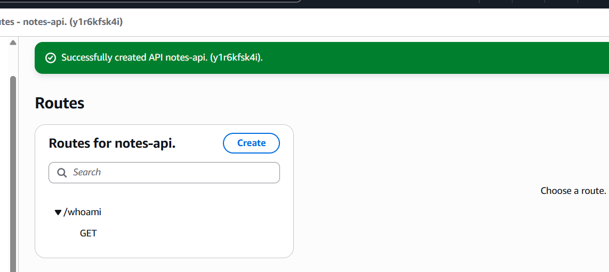
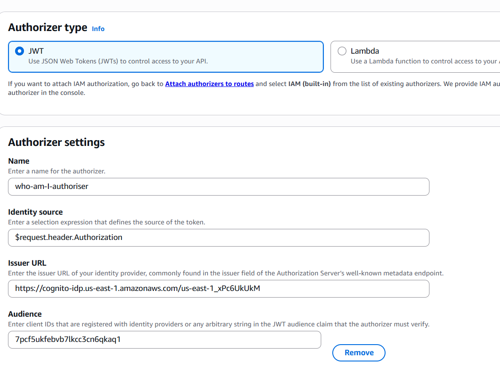
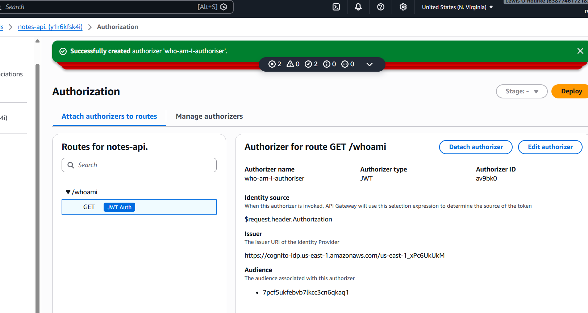

# Component 2: API Gateway with JWT Authorizers

## Overview

The goal of this component was to secure the Notes API by introducing authentication using **Amazon Cognito** and **API Gateway JWT Authorizers**.

In Component 1, Amazon Cognito was configured to authenticate users and issue signed JSON Web Tokens (JWTs). Building on that foundation, this component focuses on protecting an API endpoint so that only authenticated users can access it.

Rather than implementing note creation or retrieval immediately, the objective was first to verify that the authentication flow worked correctly from end to end. This involved creating a Lambda function capable of identifying the authenticated user, exposing it through API Gateway, and configuring a JWT Authorizer to validate incoming access tokens before any request reached the backend.

---

# Architecture

```text
                 Amazon Cognito
                      │
          Issues signed JWT Access Token
                      │
                      ▼
              HTTP Request
Authorization: Bearer <JWT>
                      │
                      ▼
              API Gateway HTTP API
             (JWT Authorizer)
                      │
          ┌───────────┴────────────┐
          │                        │
   Invalid Token             Valid Token
          │                        │
      HTTP 401                 Invoke Lambda
                                   │
                                   ▼
                            whoamiHandler
                                   │
                                   ▼
                           Return User ID
```

---

# Objectives

By the end of this component the application should be able to:

- Create a Lambda function capable of identifying the authenticated user.
- Expose the Lambda function through an HTTP API.
- Protect the API using a JWT Authorizer.
- Reject unauthenticated requests before they reach the backend.
- Pass verified JWT claims directly into the Lambda function.

---

# AWS Services Used

| Service | Purpose |
|----------|---------|
| Amazon Cognito | User authentication and JWT generation |
| Amazon API Gateway | HTTP API endpoint |
| JWT Authorizer | Validates Cognito-issued JWTs |
| AWS Lambda | Reads authenticated user claims |
| AWS CloudShell | CLI authentication and API testing |
| jwt.io | JWT inspection and verification |

---

# Step 1 – Creating the Authentication Lambda

The first task was creating a Lambda function named **`whoamiHandler`**.

Rather than implementing business logic, this function serves a single purpose: returning the authenticated user's unique Cognito identifier (`sub`) after a JWT has been successfully validated by API Gateway.

This simple approach makes it easy to verify that authentication is functioning correctly before introducing more complex functionality such as DynamoDB integration.

The function was created using the following configuration:

- **Runtime:** Python 3.13
- **Architecture:** arm64
- **Execution Role:** Default Lambda execution role
- **Function Name:** `whoamiHandler`

The default Lambda template was replaced with the following code:

```python
import json

def lambda_handler(event, context):
    claims = event.get('requestContext', {}) \
                  .get('authorizer', {}) \
                  .get('jwt', {}) \
                  .get('claims', {})

    user_id = claims.get('sub', 'unknown')

    return {
        'statusCode': 200,
        'body': json.dumps({
            'message': 'Authorized',
            'userId': user_id
        })
    }
```

---

## Understanding the Lambda Function

One of the key design decisions in this component was **not** to validate JWTs inside the Lambda function.

Instead, the function simply reads the claims already verified by API Gateway:

```python
event.requestContext.authorizer.jwt.claims
```

This means the Lambda function does **not** perform:

- JWT signature verification
- Expiration checks
- Issuer validation
- Audience validation

Those responsibilities are delegated entirely to API Gateway, allowing each Lambda function to remain focused solely on application logic.

This separation of responsibilities follows AWS best practices for building secure serverless applications.

---

# Testing the Lambda

Before introducing API Gateway, the function was tested directly within the Lambda console.

Because Lambda test events bypass API Gateway completely, no JWT claims are included within the event payload.

As expected, the function successfully executed and returned the fallback value of `"unknown"` for the user identifier.

### Screenshot – Lambda Console Test


The execution result confirms that the function completed successfully and returned:

```json
{
    "statusCode": 200,
    "body": "{\"message\":\"Authorized\",\"userId\":\"unknown\"}"
}
```

This behaviour is expected because the Lambda function has not yet received any authenticated JWT claims.

Once API Gateway and the JWT Authorizer are introduced later in this component, the `"unknown"` value will be replaced with the authenticated user's Cognito `sub` claim.

---

# What Was Achieved

At the end of this stage:

- A dedicated authentication Lambda function was created.
- The function successfully executed within the Lambda console.
- The fallback logic correctly handled requests without JWT claims.
- The function was ready to be integrated with Amazon API Gateway and a JWT Authorizer.

---

## Skills Demonstrated

- AWS Lambda
- Python
- JSON Processing
- JWT Claims
- Serverless Architecture
- Authentication Design
- CloudWatch Logging

# Step 2 – Creating the HTTP API

With the authentication Lambda successfully tested, the next step was to expose it through **Amazon API Gateway**.

An **HTTP API** was chosen over a REST API because it provides a simpler, lower-cost solution while still supporting JWT Authorizers. Since this project only required a secure endpoint that could validate authentication tokens, an HTTP API was the most appropriate choice.

A new API named **`notes-api`** was created with a single route:

- **Route:** `GET /whoami`
- **Integration:** `whoamiHandler`

At this stage, the endpoint was publicly accessible and had not yet been secured with authentication.

### Screenshot – HTTP API Created



The screenshot above shows the newly created HTTP API with the `/whoami` route configured. Creating this endpoint first allowed the API to be tested before introducing authentication.

---

## Why Create a `/whoami` Endpoint?

Rather than immediately implementing CRUD operations for notes, a simple endpoint was created that returns the authenticated user's identity.

This provides a straightforward way to verify that authentication is functioning correctly.

The expected behaviour would eventually become:

- Requests without a valid JWT should be rejected by API Gateway.
- Requests with a valid JWT should invoke the Lambda function.
- The Lambda should return the authenticated user's Cognito `sub` claim.

Once this behaviour was verified, the same authentication architecture could then be reused for future endpoints such as creating, retrieving, updating and deleting notes.

---

# Step 3 – Configuring the JWT Authorizer

With the API created, the next step was securing the `/whoami` endpoint using a **JWT Authorizer**.

Unlike REST APIs, HTTP APIs do not provide a dedicated "Cognito Authorizer". Instead, they use a standards-based **JWT Authorizer**, which validates JSON Web Tokens issued by any OpenID Connect (OIDC) compatible identity provider.

Since Amazon Cognito issues standards-compliant JWTs, it integrates seamlessly with API Gateway's JWT Authorizer.

The authorizer was configured using the following settings:

| Setting | Value |
|---------|-------|
| Authorizer Type | JWT |
| Name | `who-am-I-authoriser` |
| Identity Source | `$request.header.Authorization` |
| Issuer URL | `<Redacted>` |
| Audience | `<Redacted>` |

> **Note:** The Issuer URL and Audience have been redacted from this repository because they uniquely identify the Cognito User Pool and App Client used during development.

### Screenshot – JWT Authorizer Configuration



The screenshot above shows the completed JWT Authorizer configuration. API Gateway will use these settings to verify every incoming access token before forwarding requests to the backend.

---

## Understanding the JWT Authorizer

The JWT Authorizer is responsible for validating every access token presented to the API.

Rather than simply checking that a token exists, API Gateway performs several security checks before allowing the request to continue.

These include:

- Verifying the JWT signature.
- Confirming the token has not expired.
- Validating that the token was issued by the configured Cognito User Pool (Issuer).
- Confirming the token was generated for the correct application (Audience).

If any of these checks fail, API Gateway immediately returns an **HTTP 401 Unauthorized** response and the Lambda function is never invoked.

By performing authentication at the API Gateway layer, every downstream Lambda function can trust the identity information it receives without implementing its own JWT validation logic.

---

## Attaching the JWT Authorizer to the API Route

Once the authorizer had been created, it was attached to the existing **`GET /whoami`** route.

From this point onwards, every request made to the endpoint would first pass through the JWT Authorizer before reaching the Lambda function.

Only requests containing a valid Cognito-issued Access Token within the `Authorization` header would be allowed to continue.

### Screenshot – JWT Authorizer Attached to Route



The screenshot above confirms that the `GET /whoami` route is now protected using the **who-am-I-authoriser** JWT Authorizer.

This means authentication is now enforced centrally by API Gateway, preventing unauthenticated requests from reaching the backend.

---

## Request Flow

After attaching the JWT Authorizer, every request follows the authentication flow shown below.

```text
                Client Request
                     │
                     ▼
          API Gateway HTTP API
                     │
             JWT Authorizer
                     │
     ┌───────────────┴───────────────┐
     │                               │
 Invalid or Missing JWT         Valid JWT
     │                               │
HTTP 401 Unauthorized          Invoke Lambda
                                     │
                                     ▼
                            Read JWT Claims
                                     │
                                     ▼
                         Return Authenticated User
```

This architecture keeps authentication separate from business logic and ensures that invalid requests are rejected before consuming Lambda execution time.

---

# What Was Achieved

At the end of this stage:

- An HTTP API was created using Amazon API Gateway.
- The `/whoami` endpoint was configured and integrated with the Lambda function.
- A JWT Authorizer was created using Amazon Cognito.
- Authentication was enforced at the API Gateway layer.
- The `/whoami` route was successfully protected using the JWT Authorizer.
- The API was now ready to be tested using valid and invalid Cognito Access Tokens.

---

## Skills Demonstrated

- Amazon API Gateway
- HTTP APIs
- Amazon Cognito
- JWT Authorizers
- OpenID Connect (OIDC)
- API Security
- Serverless Authentication
- Secure API Design

# Step 4 – Authenticating with Amazon Cognito

With the API now protected by a JWT Authorizer, the next stage was verifying that only authenticated users could access the `/whoami` endpoint.

To achieve this, an Access Token first needed to be obtained from Amazon Cognito. This token would then be included in the HTTP `Authorization` header when sending requests to the API.

Authentication was performed using the AWS CLI from **AWS CloudShell**.

The following command initiates the authentication process using the **USER_PASSWORD_AUTH** flow.

```bash
aws cognito-idp initiate-auth \
  --auth-flow USER_PASSWORD_AUTH \
  --client-id <app-client-id> \
  --auth-parameters \
USERNAME=<email-address>,PASSWORD=<password>
```

> **Note:** The App Client ID, email address and password have been replaced with placeholders for security reasons.

If the supplied credentials are valid, Amazon Cognito returns an authentication response containing several tokens.

These include:

- **Access Token** – Used to authenticate API requests.
- **ID Token** – Contains information about the authenticated user.
- **Refresh Token** – Used to obtain new Access and ID tokens without requiring the user to log in again.

For this component, only the **Access Token** was required.

---

# Extracting the Access Token

Rather than manually copying the Access Token from the CLI output, the authentication response was stored in a shell variable and parsed using **jq**.

```bash
RESPONSE=$(aws cognito-idp initiate-auth \
  --auth-flow USER_PASSWORD_AUTH \
  --client-id <app-client-id> \
  --auth-parameters \
USERNAME=<email-address>,PASSWORD=<password>)
```

The Access Token was then extracted using:

```bash
ACCESS_TOKEN=$(echo "$RESPONSE" | jq -r '.AuthenticationResult.AccessToken')
```

Automating this process helped prevent mistakes when copying long JWT strings manually and made subsequent API testing significantly easier.

---

# Testing the Protected Endpoint

With a valid Access Token available, the `/whoami` endpoint could now be tested.

Requests were sent using **curl**, with the Access Token included within the `Authorization` header using the standard Bearer token format.

```bash
curl https://<api-endpoint>/whoami \
  -H "Authorization: Bearer $ACCESS_TOKEN"
```

Because the request contained a valid Cognito-issued Access Token, API Gateway successfully authenticated the request before invoking the Lambda function.

The Lambda function then read the authenticated user's claims from the request context and returned the user's unique Cognito identifier (`sub`).

A successful response resembled the following:

```json
{
    "message": "Authorized",
    "userId": "<cognito-sub>"
}
```

This confirmed that the complete authentication flow was functioning correctly.

---

# Understanding the Authentication Flow

One of the key objectives of this component was understanding **where authentication actually occurs**.

Although the Lambda function returns the authenticated user's identity, it never validates the JWT itself.

Instead, authentication is performed entirely by API Gateway.

The complete request flow is shown below.

```text
Amazon Cognito
        │
 Issues signed JWT
        │
        ▼
Client sends request
Authorization: Bearer <JWT>
        │
        ▼
API Gateway JWT Authorizer
        │
Verifies:
• Signature
• Expiration
• Issuer
• Audience
        │
        ▼
Authentication Successful
        │
        ▼
Invoke Lambda
        │
Reads:
event.requestContext.authorizer.jwt.claims
        │
        ▼
Return Authenticated User
```

This separation of responsibilities simplifies the Lambda function considerably.

Rather than implementing authentication logic within every backend function, API Gateway performs validation once and forwards only trusted identity information.

---

# Troubleshooting

During testing, several authentication issues were encountered before the API was working correctly.

### Lambda Test Events

Initially, the Lambda function always returned:

```json
"userId": "unknown"
```

This behaviour was expected because Lambda console test events bypass API Gateway entirely and therefore contain no authenticated JWT claims.

---

### Invalid JWT Tokens

Several requests returned **HTTP 401 Unauthorized** responses.

After investigation, these failures were traced back to malformed JWTs that had been accidentally truncated while copying them from the terminal.

To eliminate this issue, the Access Token was extracted automatically using **jq**, removing the need to manually copy long JWT strings.

---

### JWT Authorizer Configuration

Another important verification step was confirming that the JWT Authorizer had been attached to the correct route.

Without the authorizer attached, API Gateway would allow unauthenticated requests to reach the backend.

Once attached correctly, API Gateway automatically rejected requests that did not contain a valid Cognito-issued Access Token.

---

# What Was Achieved

At the end of this stage:

- Successfully authenticated with Amazon Cognito using the AWS CLI.
- Generated a valid JWT Access Token.
- Used the Access Token to authenticate requests to the API.
- Verified that API Gateway correctly validated incoming JWTs.
- Confirmed that authenticated user claims were automatically passed to the Lambda function.
- Demonstrated the complete authentication flow from Cognito to API Gateway to Lambda.

The API was now fully protected and ready to support authenticated CRUD operations in the next stage of the project.

---

## Skills Demonstrated

- Amazon Cognito
- AWS CLI
- CloudShell
- JWT Authentication
- API Testing
- HTTP Authorization Headers
- Bash
- jq
- Authentication Troubleshooting
- Secure Serverless Architecture

# Verification

The completed implementation was tested to ensure that each stage of the authentication process behaved as expected.

| Test | Expected Result | Outcome |
|------|-----------------|---------|
| Invoke the Lambda function directly | Returns `"userId": "unknown"` because no JWT claims are present | ✅ Passed |
| Create an HTTP API and integrate the Lambda | API successfully exposes the `/whoami` endpoint | ✅ Passed |
| Configure a JWT Authorizer | API Gateway validates Cognito-issued JWTs | ✅ Passed |
| Attach the JWT Authorizer to the route | Requests now require authentication | ✅ Passed |
| Authenticate using Amazon Cognito | Valid Access Token successfully generated | ✅ Passed |
| Call the API with a valid Access Token | Lambda returns the authenticated user's Cognito `sub` claim | ✅ Passed |

These tests confirmed that authentication was functioning correctly throughout the entire request lifecycle.

---

# Security Considerations

This component was designed around AWS security best practices by separating authentication from application logic.

## Authentication at the API Gateway Layer

Instead of validating JWTs within every Lambda function, authentication is delegated entirely to API Gateway.

Before forwarding a request, the JWT Authorizer verifies:

- The JWT signature.
- The token has not expired.
- The token was issued by the configured Amazon Cognito User Pool.
- The token was issued for the correct App Client (Audience).

Only requests containing valid Access Tokens are forwarded to the backend.

This reduces duplicated authentication code and ensures that every protected endpoint applies the same validation rules.

---

## Principle of Least Privilege

The Lambda execution role was intentionally kept minimal throughout this component.

Only the permissions required for Lambda execution and CloudWatch logging were granted.

Additional IAM permissions will be introduced in later components only when they are required to interact with other AWS services such as DynamoDB.

---

## Protecting Sensitive Information

To ensure this repository can be shared publicly, sensitive information has been removed or replaced with placeholders.

Examples include:

- Cognito User Pool IDs
- App Client IDs
- Email addresses
- Passwords
- JWT Access Tokens
- Refresh Tokens
- AWS Account IDs
- API Gateway URLs

This allows the implementation to be documented without exposing credentials or infrastructure details.

---

# Key Concepts Learned

Completing this component reinforced several important concepts surrounding authentication within serverless applications.

## Amazon Cognito

Amazon Cognito provides a managed authentication service capable of securely registering users, authenticating credentials and issuing signed JSON Web Tokens.

Using Cognito removes the need to build and maintain custom authentication systems while integrating seamlessly with other AWS services.

---

## JWT Authorizers

API Gateway HTTP APIs use JWT Authorizers to validate authentication tokens before requests reach backend services.

Rather than simply checking whether a token exists, the authorizer verifies multiple aspects of the JWT before allowing the request to continue.

Delegating authentication to API Gateway simplifies backend development and improves consistency across the application.

---

## Authentication vs Authorization

One of the most valuable lessons from this component was understanding the difference between authentication and authorization.

**Authentication** answers the question:

> *Who is the user?*

Amazon Cognito authenticates the user and issues a signed JWT.

**Authorization** answers the question:

> *Is this request allowed to access this resource?*

API Gateway authorizes requests by validating the JWT before allowing access to the protected endpoint.

Future components will build upon this by ensuring users are only authorised to access their own notes stored within DynamoDB.

---

## JWT Claims

Once authentication has been completed successfully, API Gateway injects the verified JWT claims into the Lambda event.

Rather than decoding or verifying tokens manually, the Lambda simply reads:

```python
event["requestContext"]["authorizer"]["jwt"]["claims"]
```

For this project, the most important claim is:

```text
sub
```

The `sub` claim uniquely identifies every Cognito user and will later be used as the partition key when storing notes in DynamoDB.

This ensures every user can only access their own records.

---

# Challenges Encountered

Although the overall implementation was straightforward, several challenges were encountered during development.

## Testing Lambda Directly

Initially, it appeared that the Lambda function was not reading authenticated user information because every test returned `"userId": "unknown"`.

This behaviour was expected because Lambda test events bypass API Gateway entirely and therefore contain no authenticated JWT claims.

Understanding the difference between testing Lambda directly and testing through API Gateway was an important learning point.

---

## Working with JWTs

JWTs are long encoded strings and can easily become corrupted when copied manually.

During testing, malformed tokens resulted in HTTP 401 Unauthorized responses.

Using the AWS CLI together with `jq` simplified the testing process by extracting the Access Token automatically.

---

## Understanding API Gateway Authentication

Initially, it was unclear why HTTP APIs did not include a dedicated Cognito Authorizer like REST APIs.

Further investigation showed that HTTP APIs instead implement a generic JWT Authorizer based on the OpenID Connect (OIDC) standard.

Since Amazon Cognito issues standards-compliant JWTs, this approach provides the same functionality while supporting multiple identity providers.

---

# Skills Demonstrated

Throughout this component, the following AWS services and concepts were implemented:

- Amazon Cognito
- Amazon API Gateway
- JWT Authorizers
- HTTP APIs
- AWS Lambda
- Python
- AWS CLI
- CloudShell
- JSON Web Tokens (JWT)
- OpenID Connect (OIDC)
- Serverless Authentication
- IAM
- CloudWatch Logging
- Secure API Design
- Authentication Architecture

---

# Future Improvements

With authentication successfully implemented, the next stage of the project will focus on building the application's core functionality.

Planned improvements include:

- Creating notes using Amazon DynamoDB.
- Retrieving notes belonging to the authenticated user.
- Updating existing notes.
- Deleting notes.
- Restricting data access using the authenticated Cognito `sub` claim.
- Applying least-privilege IAM permissions for DynamoDB access.

This will transform the project from an authentication demonstration into a fully functional multi-user serverless notes application.

---

# Conclusion

This component successfully introduced secure authentication into the Notes API using Amazon Cognito and API Gateway JWT Authorizers.

Rather than validating JWTs inside every Lambda function, authentication is handled centrally by API Gateway. This ensures that only authenticated requests reach the backend while allowing Lambda functions to remain focused solely on business logic.

By completing this stage, a secure authentication foundation has been established that can be reused throughout the remainder of the application as additional features are introduced.
