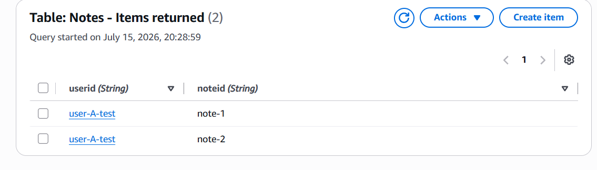
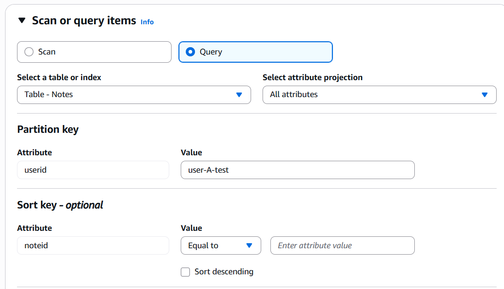

# Component 3: Designing a DynamoDB Table for User-Isolated Notes

## Overview

With authentication successfully implemented in the previous component, the next step was designing the database that would store each user's notes.

Rather than simply creating a table capable of storing data, this component focused on designing the table around the application's access patterns. The most important requirement was ensuring users could efficiently retrieve **only their own notes**, while preventing access to another user's data through the table's structure rather than relying solely on application logic.

To achieve this, Amazon DynamoDB was chosen as the database service due to its fully managed, serverless architecture and fast key-value lookups.

---

# Objectives

By the end of this component the application should be able to:

- Create a DynamoDB table for storing notes.
- Design an appropriate primary key for the application's access pattern.
- Group all notes belonging to a single user together.
- Ensure multiple notes can exist for the same user.
- Demonstrate efficient retrieval of notes using a DynamoDB Query.

---

# AWS Services Used

| Service | Purpose |
|----------|---------|
| Amazon DynamoDB | Serverless NoSQL database used to store user notes |

---

# Step 1 – Creating the Notes Table

A new DynamoDB table named **Notes** was created using the following configuration:

| Setting | Value |
|---------|-------|
| Table Name | Notes |
| Partition Key | `userid` (String) |
| Sort Key | `noteid` (String) |
| Capacity Mode | On-Demand |
| Encryption | Default AWS Managed |
| Deletion Protection | Default |

On-Demand capacity was selected because the application is expected to experience unpredictable and relatively low traffic. This pricing model automatically scales with demand without requiring capacity planning.

### Screenshot – Notes Table Created


The screenshot above shows the completed DynamoDB table using a composite primary key consisting of **userid** and **noteid**.

---

# Step 2 – Designing the Primary Key

Choosing the primary key was the most important design decision in this component.

Unlike Project 1, where a single partition key was sufficient, this application needs to support a common access pattern:

> **"Return every note belonging to the currently authenticated user."**

To support this efficiently, the table uses a **composite primary key**.

- **Partition Key:** `userid`
- **Sort Key:** `noteid`

This allows DynamoDB to group all notes belonging to the same user together while still allowing each individual note to remain unique.

Rather than querying the entire table, future Lambda functions will simply query the authenticated user's partition using the `sub` claim extracted from the validated JWT.

This means every request naturally scopes itself to the authenticated user's data.

---

## Why `userid`?

The authenticated user's Cognito **sub** value will become the `userid` stored within DynamoDB.

Every CRUD operation performed by the application will use this value when querying the table.

Because Lambda only ever reads the authenticated user's identity from:

```python
event["requestContext"]["authorizer"]["jwt"]["claims"]["sub"]
```

there is no opportunity for a client to specify another user's identifier.

This creates data isolation through the table design itself rather than relying solely on permission checks inside application code.

---

## Why `noteid`?

While the partition key groups every note belonging to a user together, each note still requires its own unique identifier.

The sort key provides this uniqueness.

Without a sort key, every item in the table would require a unique `userid`.

That would mean creating a second note for the same user would overwrite the first note because both items would share the same primary key.

Instead, each note receives its own unique `noteid`, allowing multiple notes to exist within the same user partition.

---

# Step 3 – Populating the Table

Once the table had been created, sample data was inserted to simulate multiple users.

Two users were created:

- **user-A-test**
- **user-B-test**

User A was given two notes, while User B was given one.

### Screenshot – Sample Data


This simple dataset provides an effective way of verifying that queries only return data belonging to the specified partition key.

---

# Step 4 – Querying User Data

To validate the table design, DynamoDB's **Query** operation was used.

The query searched for:

```text
Partition Key:
userid = user-A-test
```

### Screenshot – Query Configuration



Unlike a Scan operation, Query searches a single partition rather than reading every item in the table.

This makes it significantly more efficient while also matching the application's real-world access pattern.

Executing the query returned only the two notes belonging to **user-A-test**.

### Screenshot – Query Results



No records belonging to **user-B-test** were returned.

Although this is only test data, it demonstrates the same access pattern that the application will later use when the authenticated Cognito user's `sub` value replaces the test `userid`.

---

# Why Not Use Only a Partition Key?

Initially it may seem that using only `userid` as the partition key would be sufficient.

However, without a sort key the entire primary key would simply become:

```text
userid
```

This would prevent a user from storing multiple notes.

For example:

```text
userid = user-A
```

Creating the first note would succeed.

Creating a second note with the same `userid` would not append another record—it would overwrite the existing item because the primary key already exists.

Adding `noteid` as the sort key solves this problem by allowing multiple unique items to exist within the same user partition.

The partition key groups the data.

The sort key uniquely identifies each item within that group.

---

# What Was Achieved

At the end of this component:

- A DynamoDB table was successfully created.
- A composite primary key was designed around the application's access pattern.
- Sample data representing multiple users was inserted.
- DynamoDB Query successfully returned only one user's notes.
- The table structure was prepared for secure CRUD operations in the next component.

---

# Key Concepts Learned

- Designing tables around access patterns.
- Composite primary keys.
- Partition Keys vs Sort Keys.
- Query vs Scan.
- Data isolation through table design.
- Serverless NoSQL databases.

---

# Skills Demonstrated

- Amazon DynamoDB
- Single-table design
- Composite Primary Keys
- Partition Keys
- Sort Keys
- DynamoDB Query
- NoSQL Data Modelling
- Serverless Database Design
