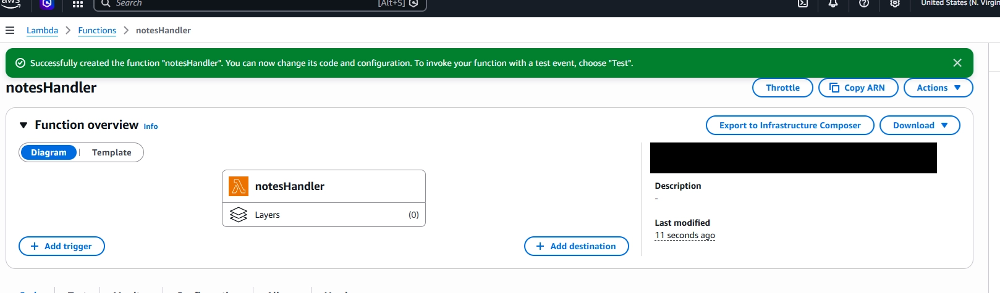
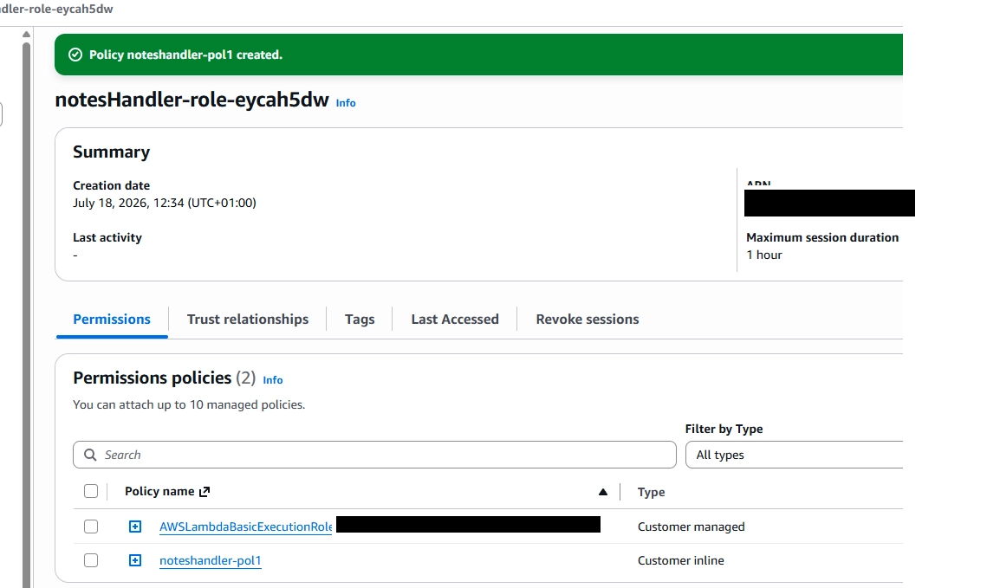
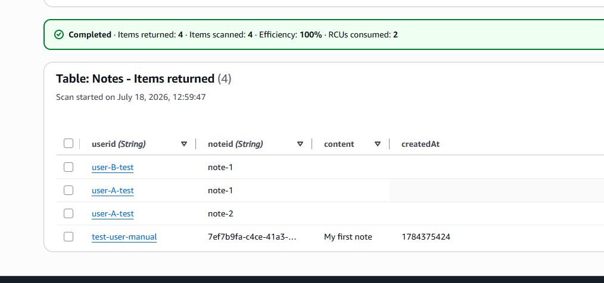

# Component 4: IAM Permissions and CRUD Lambda Logic

## Overview

With authentication, API protection and the DynamoDB data model already established, the next stage was implementing the application's actual CRUD logic.

This component introduced a new Lambda function named **`notesHandler`**, responsible for:

- Creating notes
- Listing a user's notes
- Updating an existing note
- Deleting a note

The function uses the authenticated user's Cognito `sub` claim as the DynamoDB partition-key value for every operation.

The client is never trusted to provide its own `userid`. Instead, identity is always read from the verified JWT claims injected into the request by API Gateway.

This is where the authentication, authorization and database design from the previous components are brought together in application code.

---

# Objectives

The objectives of this component were to:

- Create a Lambda function containing the Notes API business logic.
- Grant the function only the DynamoDB permissions it requires.
- Implement create, list, update and delete operations.
- Scope every database operation to the authenticated user.
- Test each CRUD operation directly through Lambda.
- Resolve DynamoDB data-type and serialization issues.

---

# AWS Services Used

| Service | Purpose |
|---|---|
| AWS Lambda | Runs the CRUD application logic |
| Amazon DynamoDB | Stores each user's notes |
| AWS IAM | Grants the Lambda controlled access to the `Notes` table |
| Amazon CloudWatch | Stores Lambda execution logs |

---

# Step 1 – Creating the CRUD Lambda

A new Lambda function named **`notesHandler`** was created specifically for the application's CRUD functionality.

It was configured with:

| Setting | Value |
|---|---|
| Function name | `notesHandler` |
| Runtime | Python 3.13 |
| Architecture | arm64 |
| Initial execution role | Basic Lambda execution permissions |

The initial role allowed the function to write logs to CloudWatch but did not yet grant access to DynamoDB.

### Screenshot – `notesHandler` Created



The screenshot above confirms that the new `notesHandler` Lambda function was successfully created.

> **Security note:** Blur or crop the AWS account ID shown in the function ARN before publishing this screenshot.

---

# Step 2 – Applying Least-Privilege IAM Permissions

The function required permission to perform CRUD operations against the `Notes` DynamoDB table.

Rather than granting broad DynamoDB access, an inline IAM policy was added to the Lambda execution role containing only the actions required by the application:

- `dynamodb:PutItem`
- `dynamodb:GetItem`
- `dynamodb:Query`
- `dynamodb:UpdateItem`
- `dynamodb:DeleteItem`

The policy was restricted to the specific ARN of the `Notes` table.

```json
{
  "Version": "2012-10-17",
  "Statement": [
    {
      "Sid": "AllowNotesTableAccess",
      "Effect": "Allow",
      "Action": [
        "dynamodb:PutItem",
        "dynamodb:GetItem",
        "dynamodb:Query",
        "dynamodb:UpdateItem",
        "dynamodb:DeleteItem"
      ],
      "Resource": "arn:aws:dynamodb:<region>:<account-id>:table/Notes"
    }
  ]
}
```

The region and AWS account ID have been replaced with placeholders to keep the public documentation free of account-specific information.

### Screenshot – Inline IAM Policy Created



The screenshot confirms that the Lambda role contains:

- The standard Lambda execution policy for CloudWatch logging
- A custom inline policy granting controlled access to the `Notes` table

> **Security note:** This screenshot also exposes part of the IAM role ARN and AWS account ID. Redact these before publishing.

---

## Why Use an Inline Policy?

This policy is used only by the `notesHandler` execution role and is tightly coupled to this specific function.

Using a restricted policy demonstrates the **principle of least privilege**:

> Grant only the permissions required to complete the intended task.

The function cannot:

- Delete the DynamoDB table
- Create new tables
- Read unrelated tables
- Perform administrative DynamoDB operations

It can only perform the five required item-level operations against the named `Notes` table.

---

# Step 3 – Implementing the CRUD Logic

A single router-style Lambda was used rather than creating a separate function for every API operation.

The handler examines the incoming HTTP method and routes the request internally:

| HTTP method | Function |
|---|---|
| `POST` | `create_note()` |
| `GET` | `list_notes()` |
| `PUT` | `update_note()` |
| `DELETE` | `delete_note()` |

This keeps shared logic—such as identity extraction and response formatting—in one place.

The final Lambda code was:

```python
import json
import time
import uuid
from decimal import Decimal

import boto3
from boto3.dynamodb.conditions import Key


dynamodb = boto3.resource("dynamodb")
table = dynamodb.Table("Notes")


class DecimalEncoder(json.JSONEncoder):
    """Convert DynamoDB Decimal values into JSON-compatible numbers."""

    def default(self, obj):
        if isinstance(obj, Decimal):
            return int(obj) if obj % 1 == 0 else float(obj)

        return super().default(obj)


def get_user_id(event):
    """Read the authenticated user's Cognito sub from verified JWT claims."""

    return event["requestContext"]["authorizer"]["jwt"]["claims"]["sub"]


def response(status_code, body):
    """Return a consistent API Gateway-compatible HTTP response."""

    return {
        "statusCode": status_code,
        "headers": {
            "Content-Type": "application/json"
        },
        "body": json.dumps(body, cls=DecimalEncoder)
    }


def create_note(event, user_id):
    body = json.loads(event.get("body", "{}"))
    content = body.get("content")

    if not content:
        return response(400, {
            "error": "Missing required field: content"
        })

    note_id = str(uuid.uuid4())

    item = {
        "userid": user_id,
        "noteid": note_id,
        "content": content,
        "createdAt": int(time.time())
    }

    table.put_item(Item=item)

    return response(201, item)


def list_notes(event, user_id):
    result = table.query(
        KeyConditionExpression=Key("userid").eq(user_id)
    )

    return response(200, result.get("Items", []))


def update_note(event, user_id, note_id):
    body = json.loads(event.get("body", "{}"))
    content = body.get("content")

    if not content:
        return response(400, {
            "error": "Missing required field: content"
        })

    existing = table.get_item(
        Key={
            "userid": user_id,
            "noteid": note_id
        }
    )

    if "Item" not in existing:
        return response(404, {
            "error": "Note not found"
        })

    table.update_item(
        Key={
            "userid": user_id,
            "noteid": note_id
        },
        UpdateExpression="SET content = :content",
        ExpressionAttributeValues={
            ":content": content
        }
    )

    return response(200, {
        "message": "Note updated",
        "noteId": note_id
    })


def delete_note(event, user_id, note_id):
    existing = table.get_item(
        Key={
            "userid": user_id,
            "noteid": note_id
        }
    )

    if "Item" not in existing:
        return response(404, {
            "error": "Note not found"
        })

    table.delete_item(
        Key={
            "userid": user_id,
            "noteid": note_id
        }
    )

    return response(200, {
        "message": "Note deleted",
        "noteId": note_id
    })


def lambda_handler(event, context):
    try:
        user_id = get_user_id(event)
    except (KeyError, TypeError):
        return response(401, {
            "error": "Unauthorized"
        })

    method = (
        event.get("requestContext", {})
        .get("http", {})
        .get("method")
    )

    path_parameters = event.get("pathParameters") or {}
    note_id = path_parameters.get("noteId")

    try:
        if method == "POST":
            return create_note(event, user_id)

        if method == "GET":
            return list_notes(event, user_id)

        if method == "PUT" and note_id:
            return update_note(event, user_id, note_id)

        if method == "DELETE" and note_id:
            return delete_note(event, user_id, note_id)

        return response(400, {
            "error": "Unsupported method or missing noteId"
        })

    except Exception as error:
        print(f"Error handling request: {error}")

        return response(500, {
            "error": "Internal server error"
        })
```

---

# Scoping Operations to the Authenticated User

The most important security decision in this code is how `user_id` is obtained.

```python
def get_user_id(event):
    return event["requestContext"]["authorizer"]["jwt"]["claims"]["sub"]
```

The application does not read a `userid` from:

- The request body
- A query parameter
- A path parameter
- Any other client-controlled value

Instead, it uses the Cognito `sub` claim that API Gateway has already validated.

Every database operation therefore uses:

```text
userid = authenticated caller's Cognito sub
```

This prevents a caller from changing a request body to impersonate another user.

---

# Creating a Note

The `create_note()` function:

1. Reads the note content from the request body.
2. Validates that content was supplied.
3. Generates a unique `noteid` using UUID.
4. Uses the authenticated user's `sub` as `userid`.
5. Stores the item in DynamoDB.
6. Returns HTTP `201 Created`.

A simplified test event was used to represent an authenticated POST request:

```json
{
  "requestContext": {
    "http": {
      "method": "POST"
    },
    "authorizer": {
      "jwt": {
        "claims": {
          "sub": "test-user-manual"
        }
      }
    }
  },
  "body": "{\"content\": \"My first note\"}"
}
```

The test returned HTTP `201` with a newly generated note:

```json
{
  "statusCode": 201,
  "headers": {
    "Content-Type": "application/json"
  },
  "body": "{\"userid\":\"test-user-manual\",\"noteid\":\"<generated-note-id>\",\"content\":\"My first note\",\"createdAt\":<timestamp>}"
}
```

The generated UUID, timestamp and Lambda request ID have been replaced with placeholders.

---

# Verifying the DynamoDB Write

After the successful Lambda invocation, the DynamoDB table was checked directly.

### Screenshot – Note Stored in DynamoDB



The screenshot confirms that a new item was stored with:

- `userid`
- `noteid`
- `content`
- `createdAt`

This verified that the Lambda had permission to perform `PutItem` and that the create logic was working against the real table.

---

# Listing Notes

The `list_notes()` function uses DynamoDB's `Query` operation:

```python
result = table.query(
    KeyConditionExpression=Key("userid").eq(user_id)
)
```

This returns only notes stored under the authenticated user's partition.

A GET test event was used:

```json
{
  "requestContext": {
    "http": {
      "method": "GET"
    },
    "authorizer": {
      "jwt": {
        "claims": {
          "sub": "test-user-manual"
        }
      }
    }
  }
}
```

The first test returned HTTP `500` with the following CloudWatch error:

```text
Object of type Decimal is not JSON serializable
```

---

# Resolving DynamoDB Decimal Serialization

DynamoDB stores numeric values using its `Number` data type.

When boto3 reads those values, it returns Python `Decimal` objects rather than ordinary integers or floating-point values. This preserves numerical precision, but Python's standard `json.dumps()` function cannot serialize `Decimal` automatically.

The issue appeared during the list operation because `createdAt` had completed a round trip through DynamoDB:

```text
Python int
    ↓
DynamoDB Number
    ↓
boto3 Decimal
    ↓
json.dumps() error
```

The problem was resolved by creating a custom JSON encoder:

```python
class DecimalEncoder(json.JSONEncoder):
    def default(self, obj):
        if isinstance(obj, Decimal):
            return int(obj) if obj % 1 == 0 else float(obj)

        return super().default(obj)
```

The response helper was then updated to use it:

```python
"body": json.dumps(body, cls=DecimalEncoder)
```

After this change, the GET operation returned HTTP `200` with the user's notes and a correctly formatted numerical timestamp.

---

# Updating a Note

The update operation receives the target note ID from the route path and the new content from the request body.

Before changing the item, the function checks for its existence using the complete composite key:

```python
existing = table.get_item(
    Key={
        "userid": user_id,
        "noteid": note_id
    }
)
```

The `userid` always comes from the verified token, while `noteid` comes from the request path.

A successful update returned:

```json
{
  "statusCode": 200,
  "body": "{\"message\":\"Note updated\",\"noteId\":\"<note-id>\"}"
}
```

---

# Deleting a Note

The delete operation follows the same ownership-aware lookup pattern.

```python
table.delete_item(
    Key={
        "userid": user_id,
        "noteid": note_id
    }
)
```

A successful delete returned:

```json
{
  "statusCode": 200,
  "body": "{\"message\":\"Note deleted\",\"noteId\":\"<note-id>\"}"
}
```

Because the partition-key value comes from the authenticated caller, one user cannot delete another user's note simply by supplying its `noteid`.

A lookup using:

```text
userid = caller's sub
noteid = another user's note ID
```

does not match the other user's item because the complete composite key is different.

---

# Verification

All four CRUD operations were tested directly through Lambda before wiring the function into API Gateway.

| Operation | DynamoDB action | Expected result | Outcome |
|---|---|---|---|
| Create | `PutItem` | Store a new note and return HTTP 201 | ✅ Passed |
| List | `Query` | Return notes from the caller's partition | ✅ Passed |
| Update | `GetItem`, `UpdateItem` | Confirm existence and update content | ✅ Passed |
| Delete | `GetItem`, `DeleteItem` | Confirm existence and remove the item | ✅ Passed |

Testing the Lambda in isolation made it possible to verify the application and database logic before introducing API Gateway routing in the next component.

---

# Challenges Encountered

## Case-Sensitive DynamoDB Key Names

An earlier implementation used attribute names such as:

```text
userId
noteId
```

However, the DynamoDB table had been created using:

```text
userid
noteid
```

DynamoDB attribute names are case-sensitive. The mismatch caused a validation error stating that the required partition key was missing.

The issue was resolved by ensuring every DynamoDB operation used the exact attribute names defined by the table.

---

## Decimal Values Could Not Be Serialized

DynamoDB numbers were returned by boto3 as `Decimal` values, which could not be processed by the default JSON encoder.

A reusable `DecimalEncoder` was added to the central response helper so every Lambda response could safely serialize DynamoDB numerical values.

---

## Duplicate Function Definitions

During debugging, an older duplicate version of the response helper remained later in the Python file.

Python allows functions to be redefined, and the later definition silently replaced the corrected version. As a result, the old implementation without the `DecimalEncoder` continued to execute.

The duplicate function block was removed, ensuring the corrected response helper was the only active definition.

---

# Key Design Decisions

## One Router-Style Lambda

A single Lambda handles all four operations by routing internally according to the HTTP method.

This avoids duplicating shared code such as:

- Authentication claim extraction
- DynamoDB configuration
- Response formatting
- Error handling

For a small API, this provides a simple and maintainable structure.

---

## Identity Comes Only From the JWT

The client cannot choose which DynamoDB partition to access.

The user's identity is derived exclusively from:

```python
event["requestContext"]["authorizer"]["jwt"]["claims"]["sub"]
```

This protects the application from a request containing a forged body such as:

```json
{
  "userid": "another-user",
  "content": "Attempted cross-user write"
}
```

Any supplied `userid` would simply be ignored because the function never reads it.

---

## Existence Checks Before Update and Delete

Both update and delete perform `GetItem` before modifying data.

This allows the API to return a clear HTTP `404` when the requested composite key does not exist.

It also supports structural user isolation: another user's note does not exist under the authenticated caller's partition key, even when its `noteid` is known.

---

# What Was Achieved

At the end of this component:

- A new router-style CRUD Lambda was created.
- Least-privilege DynamoDB permissions were added.
- Create, list, update and delete logic was implemented.
- Every operation was scoped using the authenticated user's JWT `sub`.
- The Lambda successfully wrote and retrieved real DynamoDB items.
- DynamoDB `Decimal` serialization was handled correctly.
- All four CRUD operations were tested successfully.
- The application logic was ready to be exposed through API Gateway.

---

# Skills Demonstrated

- AWS Lambda
- Python
- Amazon DynamoDB
- AWS IAM
- Least-Privilege Access
- CRUD API Development
- JWT Claim Processing
- boto3
- DynamoDB Query Operations
- Composite Primary Keys
- JSON Serialization
- Error Handling
- CloudWatch Logs
- Serverless Application Design
- Security-Focused Backend Development
