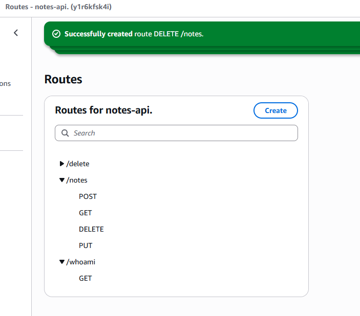
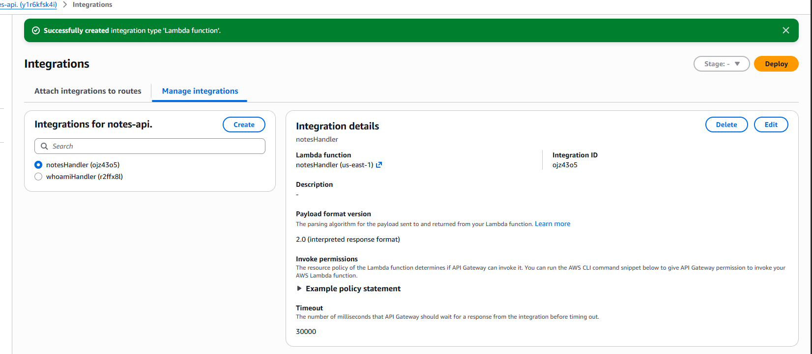
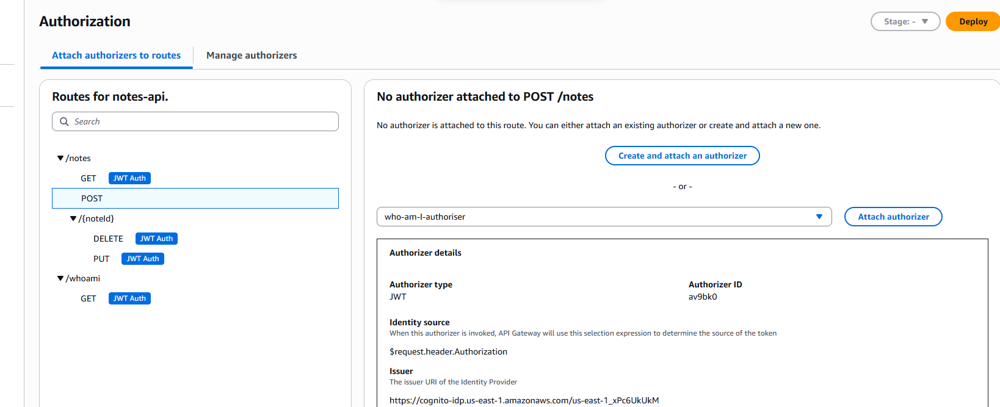
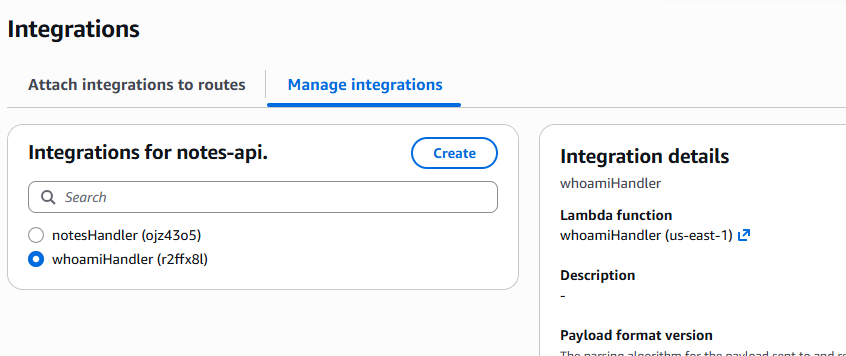
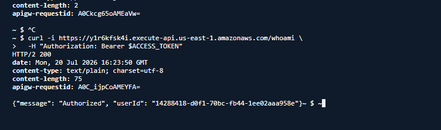
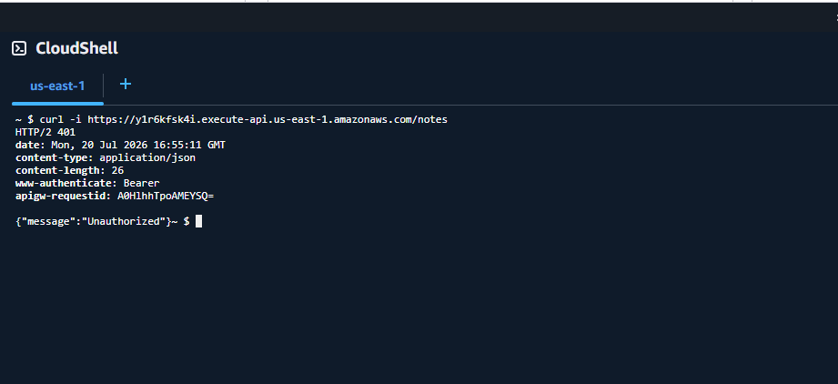
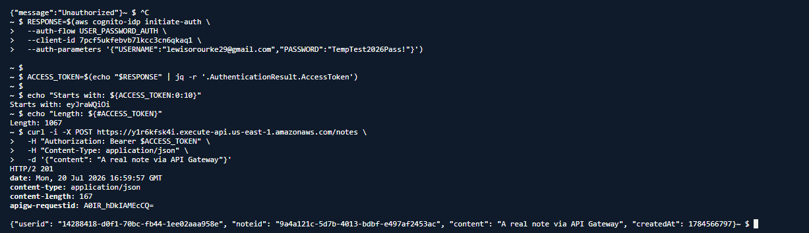
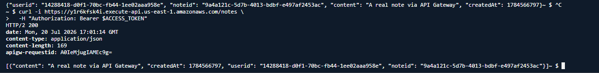
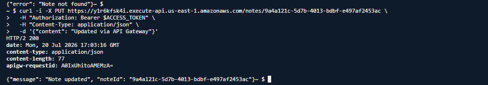
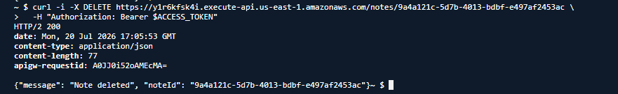

# Project 2 – Component 5: Wiring the API Gateway CRUD Routes

## Overview

In the previous components, the individual building blocks of the application were implemented independently.

- Amazon Cognito was configured to authenticate users and issue signed JWT Access Tokens.
- API Gateway was configured to validate those tokens using a reusable JWT Authorizer.
- DynamoDB was designed using a composite primary key to isolate each user's data.
- The `notesHandler` Lambda function was developed to perform authenticated CRUD operations against the Notes table.

The final step was connecting all of these services together into a fully functional REST API.

Rather than creating a new API, this component extends the existing **`notes-api`** created earlier in the project. Four authenticated CRUD endpoints were added and connected to the existing backend, allowing authenticated users to create, retrieve, update and delete their own notes through API Gateway.

This component also demonstrates one of the most important concepts within API Gateway: **routes, integrations and authorizers are separate resources**. Each route is responsible for defining the URL and HTTP method, integrations determine which backend service handles the request, and authorizers validate the caller before the request is forwarded.

---

# Architecture

```
                    Amazon Cognito
                          │
               Issues JWT Access Token
                          │
                          ▼
                    Client Request
                          │
                          ▼
                API Gateway (notes-api)
                          │
                  JWT Authorizer
                          │
        ┌─────────────────┴──────────────────┐
        │                                    │
  Invalid Token                       Valid Token
        │                                    │
HTTP 401 Unauthorized                  notesHandler
                                             │
                                             ▼
                                      Amazon DynamoDB
```

Every request must first pass JWT validation before it is forwarded to the backend Lambda function.

---

# Objectives

The objectives of this component were to:

- Extend the existing API Gateway API with CRUD endpoints.
- Create integrations between API Gateway and the `notesHandler` Lambda function.
- Reuse the existing JWT Authorizer rather than creating another.
- Understand how API Gateway routes map to backend integrations.
- Configure path parameters for item-level operations.
- Prepare the API for live end-to-end testing.

---

# AWS Services Used

| Service | Purpose |
|----------|---------|
| Amazon API Gateway | Provides authenticated REST endpoints |
| Amazon Cognito | Authenticates users and issues JWT Access Tokens |
| JWT Authorizer | Validates JWTs before invoking Lambda |
| AWS Lambda | Executes CRUD logic |
| Amazon DynamoDB | Stores authenticated users' notes |

---

# Step 1 – Creating the CRUD Routes

Using the existing **`notes-api`**, four new routes were created to expose the CRUD functionality implemented within the `notesHandler` Lambda function.

| HTTP Method | Route | Purpose |
|-------------|-------|---------|
| POST | `/notes` | Create a new note |
| GET | `/notes` | Retrieve all notes belonging to the authenticated user |
| PUT | `/notes/{noteId}` | Update an existing note |
| DELETE | `/notes/{noteId}` | Delete an existing note |

Unlike the earlier `/whoami` endpoint, which simply demonstrated authentication, these routes expose the application's real business functionality.

### Screenshot – CRUD Routes Created



The screenshot above shows the completed route configuration within API Gateway.

---

# Understanding the Route Design

One of the most important design decisions in this component was structuring the API using REST principles.

The API deliberately separates **collection-level operations** from **item-level operations**.

Collection-level operations work with the Notes collection as a whole:

```
POST /notes
GET /notes
```

Creating a note does not reference an existing resource because the server generates the `noteId` automatically.

Similarly, retrieving notes returns every note belonging to the authenticated user rather than a single record.

Item-level operations, however, must identify a specific resource.

For this reason the API uses:

```
PUT /notes/{noteId}

DELETE /notes/{noteId}
```

The `{noteId}` portion represents a **path parameter**, allowing API Gateway to identify which note should be updated or deleted.

This closely follows standard REST API conventions and produces predictable, intuitive endpoints.

---

# Understanding Path Parameters

The `{noteId}` syntax is more than just part of the URL—it represents a dynamic path parameter.

When a request is sent to:

```
PUT /notes/9a4a121c-5d7b-4013-bdbf-e497af2453ac
```

API Gateway automatically extracts:

```
9a4a121c-5d7b-4013-bdbf-e497af2453ac
```

and injects it into the Lambda event as:

```python
event["pathParameters"]["noteId"]
```

The `notesHandler` Lambda already expects this value:

```python
path_params = event.get("pathParameters") or {}
note_id = path_params.get("noteId")
```

Because API Gateway performs this extraction automatically, no manual URL parsing is required inside the application.

---

# Step 2 – Creating the Lambda Integration

Once the routes had been created, they required a backend integration.

A new API Gateway integration was created targeting the **`notesHandler`** Lambda function developed in the previous component.

Each CRUD route was then configured to use this integration.

Rather than creating four separate Lambda functions, a single integration allows every request to be forwarded to the same backend.

The Lambda function determines which CRUD operation should execute by inspecting the incoming HTTP method.

### Screenshot – notesHandler Integration



This keeps the application architecture simple while avoiding duplicated authentication, error handling and DynamoDB configuration logic across multiple Lambda functions.

---

# Step 3 – Reusing the Existing JWT Authorizer

Instead of creating a new authorizer specifically for the CRUD endpoints, the existing Cognito JWT Authorizer from Component 2 was reused.

This demonstrates an important aspect of API Gateway architecture: **authorizers are reusable resources**.

A JWT Authorizer is not tied to an individual endpoint.

Instead, it represents a reusable validation rule capable of protecting multiple routes within the same API.

The authorizer validates every incoming JWT by checking:

- Digital signature
- Token expiration
- Token issuer
- Application audience

Only requests containing a valid Cognito-issued Access Token are forwarded to the backend Lambda.

Every CRUD route was configured to use this existing authorizer.

### Screenshot – JWT Authorizer Attached



Reusing the same authorizer reduces duplicated configuration while ensuring every endpoint applies identical authentication rules.

---

# Understanding API Gateway Resources

One of the key concepts learned during this stage was that API Gateway separates responsibilities across three different resources.

**Routes**

Routes define **what URL and HTTP method** should trigger a request.

Examples include:

- `POST /notes`
- `GET /notes`
- `PUT /notes/{noteId}`

---

**Integrations**

Integrations define **which backend service** should handle requests received by a route.

In this project, every CRUD route uses the `notesHandler` Lambda integration.

---

**Authorizers**

Authorizers determine **whether a caller is authenticated** before the request is forwarded.

The JWT Authorizer validates the Cognito Access Token before API Gateway invokes the backend.

Understanding the distinction between these three resources became essential during the troubleshooting phase, where incorrect integrations—not incorrect routes or authorizers—were responsible for several unexpected behaviours.

---

# What Was Achieved

By the end of this stage:

- Four authenticated CRUD routes had been created.
- RESTful route design had been implemented.
- Path parameters were configured for item-level operations.
- A dedicated `notesHandler` integration had been created.
- The existing JWT Authorizer had been successfully reused across every CRUD endpoint.
- The API was fully configured and ready for live end-to-end testing.

# Part 2 – Troubleshooting API Gateway

Building the CRUD API required significantly more troubleshooting than any previous component in this project.

Although the Lambda function had already been developed and tested independently, API Gateway introduces another layer of configuration between the client and the backend. Routes, integrations and authorizers all operate as separate resources, meaning a small configuration mistake can cause requests to be sent to the wrong backend even when authentication succeeds.

Rather than deleting resources and starting again, each issue was investigated individually until the underlying cause was understood. This provided valuable experience debugging a real-world serverless application.

---

# Issue 1 – Understanding Routes vs Integrations

One of the first lessons learned during this component was that API Gateway routes do not invoke Lambda functions directly.

Instead, each route points to an **Integration**, and the integration determines which backend resource is executed.

The relationship can be visualised as:

```
Route
    │
    ▼
Integration
    │
    ▼
Lambda Function
```

Initially this distinction was not obvious.

Because of this, several problems appeared to be route configuration issues when in reality the routes themselves were configured correctly.

The actual problem was that the integrations were pointing to the wrong Lambda function.

Understanding this separation became one of the most valuable lessons of the entire project.

---

# Issue 2 – CRUD Routes Connected to the Wrong Backend

After creating the CRUD routes, requests were not behaving as expected.

Although the routes existed correctly inside API Gateway, they were not invoking the `notesHandler` Lambda function that had been developed during the previous component.

Instead, they were still connected to the existing integration created earlier for the `/whoami` endpoint.

At this stage I realised that creating new routes alone is not enough.

Every route must also be connected to the correct backend integration.

To resolve this issue I created a dedicated integration targeting the `notesHandler` Lambda function before reattaching every CRUD endpoint to that integration.

Once completed, API Gateway correctly forwarded requests to the notes application instead of the authentication demonstration endpoint.

---

# Issue 3 – Accidentally Breaking the Existing /whoami Endpoint

While configuring the new CRUD integration I accidentally modified the existing `/whoami` integration.

Instead of creating a brand new integration, I edited the existing one and changed its backend from:

```
whoamiHandler
```

to

```
notesHandler
```

At first this mistake was not immediately obvious because API Gateway continued returning HTTP 200 responses.

However, the response body had changed completely.

Rather than returning:

```json
{
    "message": "Authorized",
    "userId": "..."
}
```

the endpoint returned:

```json
[]
```

This immediately suggested that authentication itself was still working.

The JWT Authorizer had accepted the token because the request reached Lambda successfully.

The problem therefore had to exist after authentication.

---

## Diagnosing the Problem

Instead of immediately rebuilding the route, I compared the response body against the Lambda functions that already existed.

The empty array looked familiar.

It matched the expected output from the `list_notes()` function whenever a user had no notes stored inside DynamoDB.

This observation provided an important clue.

API Gateway was no longer invoking:

```
whoamiHandler
```

Instead, it was executing:

```
notesHandler
```

Since the authenticated account contained no notes, the Lambda simply returned an empty list.

This confirmed that the route itself was functioning correctly.

The integration was simply pointing at the wrong Lambda function.

This was an important debugging lesson because it demonstrated how analysing response data can often reveal configuration problems without needing to inspect CloudWatch logs.

---

# Correcting the Integration

Rather than deleting and recreating the route, I investigated how API Gateway stores integrations.

The existing integration was opened through **Manage Integrations**.

Instead of replacing the route itself, I simply changed the integration's Lambda target back to:

```
whoamiHandler
```

Once saved, every route using that integration immediately began invoking the correct Lambda function again.

No changes to the route configuration were required.

This reinforced another important concept:

Routes reference integrations.

Integrations reference Lambda functions.

Changing the Lambda attached to an integration automatically changes the behaviour of every route using that integration.

### Screenshot – Restoring the Integration



---

# Verifying the Repair

After restoring the integration, the `/whoami` endpoint was tested again using CloudShell.

This time the response returned exactly as expected.

The request produced:

- HTTP 200 OK
- `"Authorized"`
- The authenticated user's unique identifier

This confirmed that the original authentication demonstration endpoint had been successfully restored without recreating the API.

### Screenshot – Successful /whoami Verification



---

# Issue 4 – Duplicate Lambda Integrations

While experimenting with API Gateway, I accidentally created multiple integrations targeting the same `notesHandler` Lambda function.

Although this did not stop the application from working, it unnecessarily complicated the API configuration.

Having multiple integrations pointing at the same backend makes it much harder to understand which integration a route is actually using.

After identifying the duplicate integration, the unnecessary copy was removed.

Only a single `notesHandler` integration remained for every CRUD endpoint.

This produced a cleaner and easier-to-maintain API configuration.

---

# Issue 5 – Incorrect Route Paths

Another issue occurred while creating the update and delete endpoints.

Initially they were created as:

```
PUT /notes

DELETE /notes
```

Although these routes were technically valid, they were not capable of identifying which note should be updated or deleted.

Unlike creating or listing notes, update and delete operations require the identifier of a specific resource.

The correct routes were therefore recreated as:

```
PUT /notes/{noteId}

DELETE /notes/{noteId}
```

This follows standard REST API conventions where collection-level operations and item-level operations use different endpoint structures.

Understanding this distinction also improved my understanding of API design beyond AWS-specific configuration.

---

# Issue 6 – Removing Unnecessary Routes

During development an unintended route was accidentally created while experimenting with API Gateway.

Although harmless, it was not part of the intended application architecture.

Rather than leaving unused resources inside the API, the unnecessary route was removed.

This helped keep the API consistent and ensured only production-ready endpoints remained.

---

# Lessons Learned from Troubleshooting

This stage of the project demonstrated that successful API development involves far more than simply writing Lambda code.

A correctly functioning API depends on multiple AWS services working together.

The troubleshooting process reinforced several key concepts:

- Routes define the URL and HTTP method.
- Integrations determine which backend service executes the request.
- Authorizers validate requests before Lambda is invoked.
- HTTP response bodies often provide valuable clues when diagnosing configuration problems.
- Small configuration mistakes can produce valid HTTP responses while still executing entirely different backend logic.
- Investigating and understanding problems is often more valuable than deleting resources and starting again.

# Part 3 – End-to-End Verification

With the API Gateway routes configured, integrations corrected and JWT Authorizer successfully protecting every endpoint, the final stage of this component was to verify that the complete serverless application functioned as expected.

Unlike previous components, this testing phase validated the entire request lifecycle rather than an individual AWS service.

Every request followed the same path:

```
Client
    │
    ▼
Amazon Cognito
    │
Issues JWT Access Token
    │
    ▼
API Gateway
    │
JWT Authorizer
    │
    ▼
notesHandler Lambda
    │
    ▼
Amazon DynamoDB
```

A successful request would prove that authentication, authorization, routing, Lambda execution and database operations were all functioning together as a single application.

---

# Preparing for Testing

Testing was performed using **AWS CloudShell** together with `curl` commands.

CloudShell provided a convenient environment for generating JWT Access Tokens, making authenticated HTTP requests and inspecting API responses without requiring any additional software.

Before beginning the CRUD tests, a new Cognito Access Token was generated.

This was necessary because:

- Cognito Access Tokens expire after approximately one hour.
- Environment variables stored inside CloudShell only exist for the current terminal session.
- Any newly opened CloudShell session requires the authentication process to be repeated.

Rather than manually copying the token from the JSON response, the output was piped through **jq** to extract only the Access Token.

For example:

```bash
ACCESS_TOKEN=$(aws cognito-idp initiate-auth ... | jq -r '.AuthenticationResult.AccessToken')
```

Using `jq` significantly reduced the possibility of introducing formatting errors while copying long JWT strings.

Before sending requests, I also performed a quick validation by checking that:

- the variable contained a value,
- the token began with a valid JWT prefix,
- the overall token length appeared correct.

These simple checks helped avoid several common authentication mistakes before making any API requests.

---

# Test 1 – Unauthenticated Request

The first test deliberately omitted the JWT Access Token.

```
GET /notes
```

Because every CRUD endpoint was protected by the Cognito JWT Authorizer, API Gateway should reject the request before invoking Lambda.

The response returned:

- HTTP 401 Unauthorized

This demonstrated that API Gateway correctly enforced authentication and prevented unauthenticated users from accessing the Notes API.

Importantly, the Lambda function was never executed because the request failed authorization first.

### Screenshot – Unauthenticated Request



---

# Test 2 – Creating a Note

The next objective was to create the first note using an authenticated request.

Initially the request failed.

Instead of creating a note, API Gateway returned an authentication error indicating that the supplied token was invalid.

After investigating, I discovered that the CloudShell environment variable no longer contained a valid JWT because the previous session had expired.

Once a fresh Access Token had been generated and exported into the terminal session, the request was repeated successfully.

The authenticated request returned:

- HTTP 201 Created
- Generated `noteId`
- Authenticated `userId`
- Submitted note content
- Creation timestamp

This represented the first successful end-to-end execution of the complete application.

The request had successfully travelled through every AWS service in the architecture before storing the record inside DynamoDB.

### Screenshot – Note Created



---

# What This Test Proved

Although the response appears relatively simple, it actually confirms that multiple AWS services are working correctly together.

A successful **Create Note** request proves that:

- Amazon Cognito authenticated the user.
- A valid JWT Access Token was issued.
- API Gateway successfully received the request.
- The JWT Authorizer validated the token.
- API Gateway forwarded the request to the correct Lambda integration.
- The `notesHandler` Lambda executed successfully.
- The Lambda generated a unique note identifier.
- DynamoDB successfully stored the new item.
- The API returned a correctly formatted HTTP response.

At this stage the Notes API had moved beyond individual service testing and become a fully functioning serverless application.

---

# Test 3 – Retrieving Notes

After creating the first note, the next step was to verify that it could be retrieved.

An authenticated request was sent to:

```
GET /notes
```

The response returned:

- HTTP 200 OK
- One stored note
- Correct authenticated user ID
- Previously submitted note content

The Lambda function executed the `list_notes()` operation, querying DynamoDB using the authenticated user's unique identifier as the partition key.

Because of this table design, only notes belonging to the authenticated user were returned.

This confirmed that user data remained isolated without requiring any additional filtering logic inside the application.

### Screenshot – Retrieve Notes



---

# Understanding User Isolation

One of the key security features of the application is that users never specify their own `userId`.

Instead, the authenticated user's identity is extracted directly from the validated JWT Access Token.

The Lambda function therefore performs database operations using the authenticated identity rather than trusting user-supplied input.

This approach prevents one user from requesting another user's notes simply by modifying the request.

The API therefore enforces logical separation between users while relying on Cognito as the trusted identity provider.

---

# Test 4 – Updating an Existing Note

The next stage was verifying the update functionality.

An authenticated request was sent to:

```
PUT /notes/{noteId}
```

where the `{noteId}` path parameter referenced the note created during the previous test.

The request returned:

- HTTP 200 OK
- `"Note updated"`

This confirmed that:

- API Gateway correctly extracted the path parameter.
- Lambda received the correct `noteId`.
- DynamoDB located the existing item.
- The stored note content was successfully updated.

Because both the authenticated `userId` and the supplied `noteId` are required to locate the record, another user's data cannot accidentally be modified.

### Screenshot – Update Note



---

# Test 5 – Deleting a Note

The final CRUD operation was deleting the existing note.

An authenticated request was sent to:

```
DELETE /notes/{noteId}
```

The response returned:

- HTTP 200 OK
- `"Note deleted"`

This demonstrated that the API correctly identified the note using both the authenticated user's identity and the supplied path parameter before removing the record from DynamoDB.

### Screenshot – Delete Note



---

# Complete CRUD Verification

By the conclusion of testing, every CRUD operation had been executed successfully.

| Operation | Result |
|----------|---------|
| Create | ✅ Successful |
| Retrieve | ✅ Successful |
| Update | ✅ Successful |
| Delete | ✅ Successful |

More importantly, every operation followed the complete authenticated request flow:

```
Client
      │
      ▼
JWT Access Token
      │
      ▼
API Gateway
      │
      ▼
JWT Authorizer
      │
      ▼
notesHandler Lambda
      │
      ▼
Amazon DynamoDB
      │
      ▼
HTTP Response
```

This demonstrated that authentication, authorization, routing, business logic and persistent storage were all operating together exactly as intended.

---

# What Was Achieved

The successful completion of the verification phase marked a significant milestone within the project.

Unlike earlier components, which focused on configuring individual AWS services, this stage validated the complete serverless architecture from end to end.

By successfully testing every CRUD operation, I confirmed that:

- Amazon Cognito correctly authenticated users.
- JWT Access Tokens were successfully validated by API Gateway.
- Every route invoked the correct Lambda integration.
- The `notesHandler` function correctly handled all CRUD operations.
- DynamoDB stored, queried, updated and deleted notes as expected.
- User data remained isolated through authenticated partition keys.
- The complete serverless application functioned as a secure, authenticated REST API.

# Part 4 – Key Concepts, Skills Demonstrated and Project Outcome

Although this component focused on wiring together previously built services, it ultimately represented the point where the entire serverless application became operational.

Earlier components introduced individual AWS services in isolation:

- Amazon Cognito authenticated users.
- API Gateway validated JWT Access Tokens.
- Lambda contained the business logic.
- DynamoDB stored application data.

This component combined those services into a complete application capable of securely processing authenticated user requests from beginning to end.

More importantly, it demonstrated how independent AWS services interact within a real-world architecture rather than simply existing as standalone components.

---

# Key Concepts Learned

## Understanding API Gateway Architecture

Before completing this project, API Gateway appeared to simply expose Lambda functions over HTTP.

In reality, API Gateway is built from several independent resources that work together.

### Routes

Routes define **how clients access the API**.

Each route consists of:

- an HTTP method
- a URL path

For example:

```
POST /notes

GET /notes

PUT /notes/{noteId}

DELETE /notes/{noteId}
```

Routes determine **when** a request should be processed.

---

### Integrations

Integrations define **where the request is sent**.

Rather than invoking Lambda functions directly, every route references an integration.

The integration then forwards requests to the backend service.

In this project, every CRUD endpoint shares a single integration targeting the `notesHandler` Lambda function.

This design avoids duplicated configuration while allowing one Lambda function to process multiple request types.

---

### Authorizers

Authorizers determine **whether a request is allowed to continue**.

Every CRUD endpoint shares the same Cognito JWT Authorizer.

Before Lambda executes, API Gateway verifies:

- JWT signature
- Token expiry
- Issuer
- Audience

Only after these checks succeed does API Gateway invoke the backend Lambda function.

This separation of responsibilities makes API Gateway both flexible and highly reusable.

---

# REST API Design

This component also reinforced several REST API principles.

Rather than creating separate endpoints for every operation, REST uses combinations of HTTP methods and resource paths.

For example:

```
POST /notes
```

creates a new resource.

```
GET /notes
```

retrieves a collection of resources.

```
PUT /notes/{noteId}
```

updates an existing resource.

```
DELETE /notes/{noteId}
```

removes an existing resource.

Using standard REST conventions makes APIs significantly easier for other developers to understand because the behaviour of each endpoint is immediately predictable.

---

# Authentication vs Authorization

Another important concept reinforced throughout this project was the distinction between authentication and authorization.

Although these terms are often used interchangeably, they perform very different roles.

### Authentication

Authentication answers the question:

> **Who is making this request?**

In this project, Amazon Cognito authenticates users after they provide valid credentials.

Once authentication succeeds, Cognito issues a signed JWT Access Token representing the authenticated identity.

---

### Authorization

Authorization answers a different question:

> **Is this authenticated user allowed to access this resource?**

API Gateway performs authorization using the JWT Authorizer.

If the supplied token:

- has expired,
- has been modified,
- was issued by another provider,
- or belongs to a different application,

the request is rejected before reaching Lambda.

Only authenticated and authorised users are permitted to execute the Notes API.

---

# Secure User Isolation

One of the strongest security features of the application is that user identity is never trusted from client input.

Instead, the authenticated user's unique identifier is extracted directly from the validated JWT Access Token.

Because of this:

- clients never provide their own `userId`,
- Lambda ignores any user identifier supplied within the request body,
- every DynamoDB query uses the authenticated identity rather than trusting client input.

This prevents one user from attempting to access another user's notes simply by modifying a request.

Although this project is relatively small, the same security principle is used throughout many production applications.

---

# End-to-End Request Lifecycle

By the completion of this component, every request followed the complete serverless execution path.

```
User

    │

Signs In

    │

Amazon Cognito

    │

Issues JWT Access Token

    │

Client Sends Request

    │

Amazon API Gateway

    │

JWT Authorizer

    │

notesHandler Lambda

    │

Amazon DynamoDB

    │

HTTP Response Returned
```

Every successful CRUD operation demonstrated that each AWS service was functioning correctly as part of a larger architecture rather than as an isolated component.

---

# Skills Demonstrated

Throughout this component I demonstrated practical experience working with several AWS services simultaneously.

## AWS Services

- Amazon API Gateway
- Amazon Cognito
- AWS Lambda
- Amazon DynamoDB
- AWS CloudShell
- IAM

---

## Technical Skills

- REST API design
- JWT authentication
- JWT authorization
- Lambda integrations
- CRUD API development
- Route configuration
- Path parameters
- HTTP methods
- CloudShell testing
- cURL
- JSON processing using jq
- End-to-end system validation
- API debugging
- Serverless application architecture

---

## Problem Solving

This component also required significantly more troubleshooting than previous stages of the project.

Rather than rebuilding resources whenever something failed, each issue was investigated individually until the underlying cause was understood.

This included:

- diagnosing incorrect integrations,
- identifying why `/whoami` returned unexpected data,
- correcting API Gateway configuration,
- recreating incorrect REST routes,
- removing duplicate integrations,
- validating authentication failures,
- confirming successful CRUD operations.

Developing a structured troubleshooting approach proved just as valuable as successfully building the application.

---

# Challenges Encountered

Several unexpected configuration issues arose during implementation.

These included:

- API Gateway integrations referencing incorrect Lambda functions.
- Accidentally modifying an existing integration instead of creating a new one.
- Creating duplicate integrations.
- Incorrect REST route paths.
- Expired JWT Access Tokens.
- CloudShell environment variables being lost between sessions.

Each challenge provided a better understanding of how API Gateway behaves internally and reinforced the importance of carefully validating configuration changes rather than assuming application code is responsible for every issue.

---

# Project Outcome

By the end of Component 5, the Notes API had evolved from a simple authentication demonstration into a fully functional authenticated serverless application.

Users can now:

- authenticate using Amazon Cognito,
- obtain a JWT Access Token,
- create notes,
- retrieve their own notes,
- update existing notes,
- delete notes,

while every request is securely validated before reaching the backend.

Perhaps more importantly, the project demonstrates a complete understanding of how authentication, API Gateway, Lambda and DynamoDB interact within a production-style serverless architecture.

Rather than simply configuring AWS services individually, this component shows how they can be combined into a secure, scalable REST API that follows modern serverless design principles.

---

# Next Steps

With the authenticated CRUD API now complete, the next stage of the project will focus on expanding the application's functionality and preparing it for production-ready features.

Potential improvements include:

- Input validation using API Gateway request validation or Lambda.
- Structured logging and monitoring with Amazon CloudWatch.
- Improved error handling and standardised API responses.
- Infrastructure as Code using AWS SAM or Terraform.
- CI/CD deployment using GitHub Actions.
- Additional API features such as pagination, searching or note categories.
